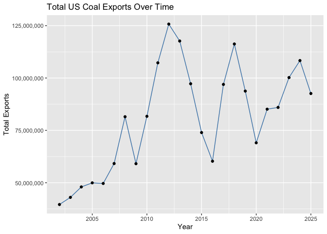
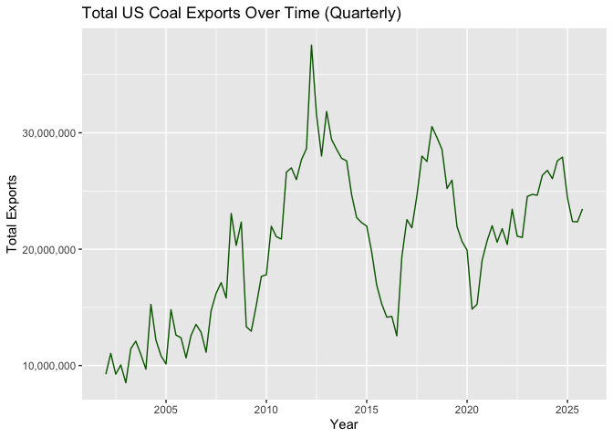
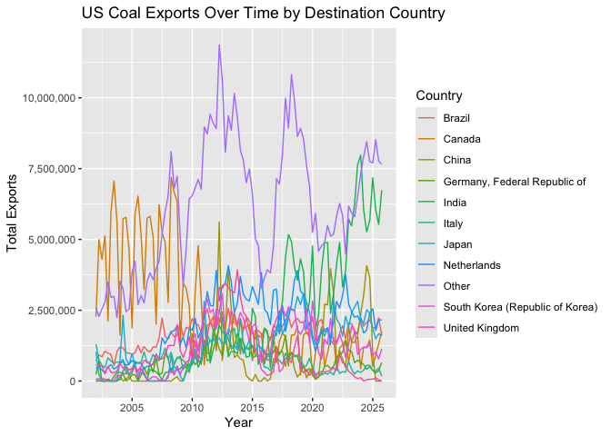
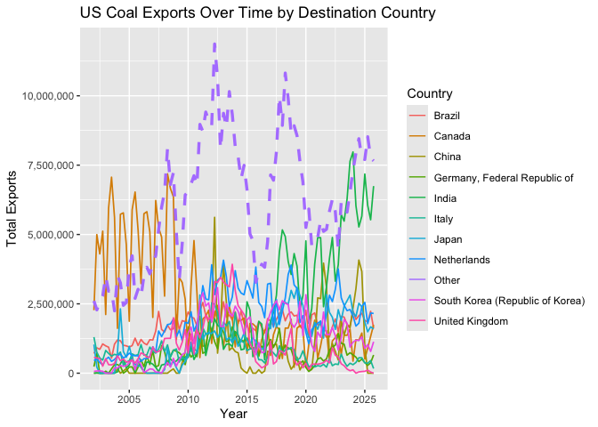
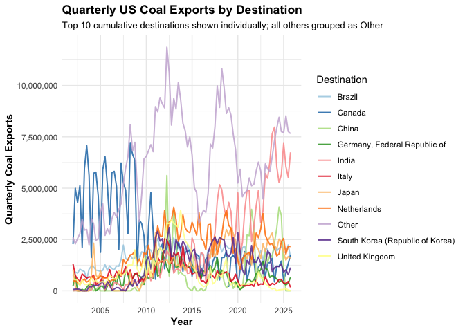
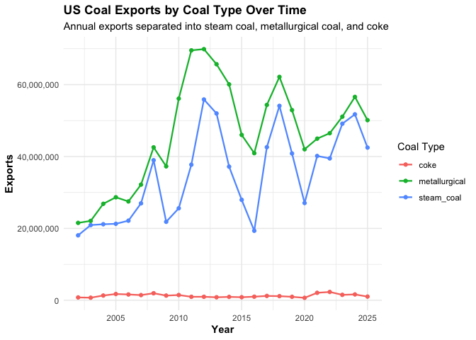

## Goal and requirements

The goal of this assignment is to impress with your data wrangling skills. 

Some additional points:  

- You can create a new GitHub repo for this assignment.  
- Name your GitHub repo something like `aec699-hw2-datawrangling-lastname`.  
- Make sure to organize your data into a `data/` folder and your code into a `scripts/` or `code/` folder.  
- Do not forget to knit the assignment (click the “Knit” button, or press `Ctrl+Shift+K`) before submitting.  
- **Please put your (written) answers in bold.**  

### What you will be graded on

- Is the code correct?  
- Are the outcomes correct?  
- Did you show your work?  
- Are the figures clear?  
- Did you follow the instructions of the assignment?  

## Preliminaries: 

### Load libraries

It is a good idea to load your libraries at the top of the Rmd document so that everyone can see what you are using. Similarly, it is good practice to set this type of chunk with `cache=FALSE` to ensure that the libraries are dynamically loaded each time you knit the document.

*Hint: I have only added the libraries needed to download and read the data. You will need to load additional libraries to complete this assignment. Add them here once you discover that you need them.* 


``` r
if (!require("pacman")) install.packages("pacman")  # install the pacman package if necessary
pacman::p_load(httr, readxl, here, tidyverse, janitor, ggplot2, plotly)  # install other packages using pacman::p_load()
```

### Read in the data

Use `httr::GET()` to fetch the EIA excel file for us from web.


``` r
# library(here)  # already loaded
# library(httr)  # already loaded
url <- "https://www.eia.gov/coal/archive/coal_historical_exports.xlsx"
if(!file.exists(here::here("data/coal.xlsx"))) {  # only download the file if we need to
  GET(url, write_disk(here::here("data/coal.xlsx")))  # modify relative path to match directory
}
```

```
## Response [https://www.eia.gov/coal/archive/coal_historical_exports.xlsx]
##   Date: 2026-04-24 08:43
##   Status: 200
##   Content-Type: application/vnd.openxmlformats-officedocument.spreadsheetml.sheet
##   Size: 997 kB
## <ON DISK>  /Users/armanshaid/Desktop/aec699-hw2-datawrangling-shaid/data/coal.xlsx
```

Next, we read in the file.


``` r
# library(readxl) already loaded
coal <- read_xlsx(here::here("data/coal.xlsx"), skip=3, na=".")
```

We are now ready to go.

## 1) Clean the column names


``` r
coal <- coal %>%
  janitor::clean_names()

names(coal)
```

```
##  [1] "year"                     "quarter"                 
##  [3] "type"                     "customs_district"        
##  [5] "coal_origin_country"      "coal_destination_country"
##  [7] "steam_coal"               "steam_revenue"           
##  [9] "metallurgical"            "metallurgical_revenue"   
## [11] "total"                    "total_revenue"           
## [13] "coke"                     "coke_revenue"
```
**I cleaned the column names using `janitor::clean_names()`, which converts names to lowercase and replaces spaces and special characters with underscores.**


## 2) Total US coal exports over time (year only)


``` r
coal_year <- coal %>%
  group_by(year) %>%
  summarise(total_exports = sum(total, na.rm = TRUE))
```


``` r
ggplot(coal_year, aes(x = year, y = total_exports)) +
  geom_line(color = "steelblue") +
  geom_point() +
  scale_y_continuous(labels = scales::comma) +
  labs(
    title = "Total US Coal Exports Over Time",
    x = "Year",
    y = "Total Exports"
  )
```

<!-- -->

**US coal exports increase substantially from the early 2000s to a peak around 2011–2013, followed by a sharp decline and then a period of fluctuation. Overall, the data show volatility rather than a consistent long-run upward or downward trend.**


## 3) Total US coal exports over time (year AND quarter)


``` r
coal_q <- coal %>%
  group_by(year, quarter) %>%
  summarise(total_exports = sum(total, na.rm = TRUE))
```


``` r
coal_q <- coal_q %>%
  mutate(date = as.Date(paste(year, (quarter - 1)*3 + 1, "01", sep = "-")))
```


``` r
ggplot(coal_q, aes(x = date, y = total_exports)) +
  geom_line(color = "darkgreen") +
  scale_y_continuous(labels = scales::comma) +
  labs(
    title = "Total US Coal Exports Over Time (Quarterly)",
    x = "Year",
    y = "Total Exports"
  )
```

<!-- -->
**The quarterly data reveal clear within-year fluctuations that are not visible in the yearly aggregation. The recurring peaks and troughs across quarters suggest seasonal patterns in coal exports, indicating that exports tend to rise and fall systematically within each year rather than moving smoothly over time.**


## 4) Exports by destination country

### 4.1) Create a new data frame

``` r
coal_country <- coal %>%
  group_by(coal_destination_country, year, quarter) %>%
  summarise(total_exports = sum(total, na.rm = TRUE), .groups = "drop") %>%
  arrange(coal_destination_country, year, quarter)

coal_country
```

```
## # A tibble: 5,750 × 4
##    coal_destination_country  year quarter total_exports
##    <chr>                    <dbl>   <dbl>         <dbl>
##  1 Albania                   2016       4            74
##  2 Albania                   2023       2         24152
##  3 Algeria                   2002       1        129305
##  4 Algeria                   2002       3         62931
##  5 Algeria                   2002       4        129563
##  6 Algeria                   2003       1        128525
##  7 Algeria                   2003       2         70539
##  8 Algeria                   2003       3        141813
##  9 Algeria                   2003       4         66499
## 10 Algeria                   2004       1        141438
## # ℹ 5,740 more rows
```


**I created `coal_country` by aggregating total coal exports by destination country, year, and quarter. The resulting data frame reports total exports for each country-quarter combination that appears in the original data.**

### 4.2) Inspect the data frame


``` r
coal_country %>%
  filter(coal_destination_country == "Albania")
```

```
## # A tibble: 2 × 4
##   coal_destination_country  year quarter total_exports
##   <chr>                    <dbl>   <dbl>         <dbl>
## 1 Albania                   2016       4            74
## 2 Albania                   2023       2         24152
```

**The data confirm that some countries (e.g., Albania) are missing observations for many year-quarter periods. This likely occurs because the U.S. did not export coal to these countries in those periods, so no records were generated in the original dataset. As a result, the dataset is unbalanced across countries and time.**


### 4.3) Complete the data frame


``` r
coal_country <- coal_country %>%
  tidyr::complete(
    coal_destination_country,
    year,
    quarter,
    fill = list(total_exports = 0)
  ) %>%
  arrange(coal_destination_country, year, quarter)

coal_country
```

```
## # A tibble: 14,592 × 4
##    coal_destination_country  year quarter total_exports
##    <chr>                    <dbl>   <dbl>         <dbl>
##  1 Albania                   2002       1             0
##  2 Albania                   2002       2             0
##  3 Albania                   2002       3             0
##  4 Albania                   2002       4             0
##  5 Albania                   2003       1             0
##  6 Albania                   2003       2             0
##  7 Albania                   2003       3             0
##  8 Albania                   2003       4             0
##  9 Albania                   2004       1             0
## 10 Albania                   2004       2             0
## # ℹ 14,582 more rows
```

**I used `tidyr::complete()` to create every possible destination country, year, and quarter combination. I filled implicit missing export values with zero because missing rows likely represent periods when there were no recorded exports to that destination. The updated data frame is now ordered by country, year, and quarter.**


### 4.4 Some more tidying up


``` r
coal_country %>%
  group_by(year, quarter) %>%
  summarise(total_exports_all_countries = sum(total_exports, na.rm = TRUE),
            .groups = "drop") %>%
  filter(total_exports_all_countries == 0)
```

```
## # A tibble: 0 × 3
## # ℹ 3 variables: year <dbl>, quarter <dbl>, total_exports_all_countries <dbl>
```

**I checked for quarters where total exports were zero across all destination countries and found none. This indicates that all year-quarter combinations in the dataset correspond to actual reporting periods. Such an issue could arise if the dataset included incomplete reporting for a particular quarter (e.g., the most recent quarter not yet fully recorded), but that was not the case here.**


### 4.5) Culmulative top 10 US coal export destinations


``` r
coal10_culm <- coal_country %>%
  group_by(coal_destination_country) %>%
  summarise(total_exports = sum(total_exports, na.rm = TRUE), .groups = "drop") %>%
  arrange(desc(total_exports)) %>%
  slice(1:10) %>%
  pull(coal_destination_country)

coal10_culm
```

```
##  [1] "Canada"                          "India"                          
##  [3] "Netherlands"                     "Brazil"                         
##  [5] "Japan"                           "South Korea (Republic of Korea)"
##  [7] "United Kingdom"                  "China"                          
##  [9] "Italy"                           "Germany, Federal Republic of"
```

**The top 10 cumulative U.S. coal export destinations over the full sample period are Canada, India, the Netherlands, Brazil, Japan, South Korea, the United Kingdom, China, Italy, and Germany. These countries represent major industrial economies with high energy demand and established trade relationships with the United States.**


### 4.6) Recent top 10 US coal export destinations


``` r
# find most recent year and quarter
latest_period <- coal_country %>%
  summarise(
    max_year = max(year),
    max_quarter = max(quarter[year == max(year)])
  )

# extract top 10 for that period
coal10_recent <- coal_country %>%
  filter(year == latest_period$max_year,
         quarter == latest_period$max_quarter) %>%
  arrange(desc(total_exports)) %>%
  slice(1:10) %>%
  pull(coal_destination_country)

coal10_recent
```

```
##  [1] "India"                           "Netherlands"                    
##  [3] "Canada"                          "Brazil"                         
##  [5] "Japan"                           "Indonesia"                      
##  [7] "Turkey"                          "South Korea (Republic of Korea)"
##  [9] "Morocco"                         "Germany, Federal Republic of"
```
**The top 10 export destinations in the most recent quarter differ from the cumulative top 10 over the full sample period. While major destinations such as India, Netherlands, Canada, Brazil, Japan, and South Korea remain important, some countries (e.g., United Kingdom, China, and Italy) drop out of the top 10 in the most recent period. At the same time, countries like Indonesia, Turkey, and Morocco appear among the recent top destinations.**

**These differences reflect short-term fluctuations in trade patterns in addition to longer-term trends. Possible explanations include seasonal demand, changes in global energy prices, shifts in trade policies, and geopolitical factors that affect coal demand and supply across countries.**


### 4.7) US coal exports over time by country


``` r
coal_plot <- coal_country %>%
  mutate(country_group = ifelse(
    coal_destination_country %in% coal10_culm,
    coal_destination_country,
    "Other"
  ))
```


``` r
coal_plot <- coal_plot %>%
  group_by(country_group, year, quarter) %>%
  summarise(total_exports = sum(total_exports, na.rm = TRUE), .groups = "drop")
```


``` r
coal_plot <- coal_plot %>%
  mutate(date = as.Date(paste(year, (quarter - 1)*3 + 1, "01", sep = "-")))
```


``` r
ggplot(coal_plot, aes(x = date, y = total_exports, color = country_group)) +
  geom_line() +
  scale_y_continuous(labels = scales::comma) +
  labs(
    title = "US Coal Exports Over Time by Destination Country",
    x = "Year",
    y = "Total Exports",
    color = "Country"
  )
```

<!-- -->


``` r
ggplot(coal_plot, aes(x = date, y = total_exports, color = country_group)) +
  geom_line(aes(
    linewidth = country_group == "Other",
    linetype = country_group == "Other"
  )) +
  scale_linewidth_manual(values = c(`TRUE` = 1.2, `FALSE` = 0.6), guide = "none") +
  scale_linetype_manual(values = c(`TRUE` = "dashed", `FALSE` = "solid"), guide = "none") +
  scale_y_continuous(labels = scales::comma) +
  labs(
    title = "US Coal Exports Over Time by Destination Country",
    x = "Year",
    y = "Total Exports",
    color = "Country"
  )
```

<!-- -->
**The figure illustrates quarterly US coal exports disaggregated by destination country, with the top 10 cumulative destinations shown individually and all remaining countries grouped into an "Other" category. I present two versions of the plot, including one that emphasizes the "Other" category with a dashed and thicker line. The results indicate a high degree of concentration in export markets, with a few countries accounting for a large share of total exports. At the same time, the "Other" category highlights the long tail of smaller destinations. While both versions convey similar patterns, the number of series makes the visualization somewhat dense. The time series also reveals substantial volatility across countries and over time, likely driven by fluctuations in global energy demand, trade dynamics, and country-specific economic conditions.**

### 4.8) Make it pretty

Take your previous plot and add some style to it. That is, try to make it as visually appealing as possible without overloading it with chart junk.


``` r
ggplot(coal_plot, aes(x = date, y = total_exports, color = country_group)) +
  geom_line(alpha = 0.85, linewidth = 0.7) +
  scale_y_continuous(labels = scales::comma) +
  scale_x_date(date_breaks = "5 years", date_labels = "%Y") +
  scale_color_brewer(palette = "Paired") +
  labs(
    title = "Quarterly US Coal Exports by Destination",
    subtitle = "Top 10 cumulative destinations shown individually; all others grouped as Other",
    x = "Year",
    y = "Quarterly Coal Exports",
    color = "Destination"
  ) +
  theme_minimal() +
  theme(
    legend.position = "right",
    plot.title = element_text(face = "bold"),
    plot.subtitle = element_text(size = 10),
    axis.title = element_text(face = "bold")
  )
```

<!-- -->

**I tried to make the plot more visually appealing by using a cleaner theme, improved axis labels, and a better color palette. I also adjusted line transparency and formatting to reduce clutter. I experimented with different styling approaches (including emphasizing the “Other” category), but kept this version for consistency, even though the plot still appears somewhat busy due to multiple overlapping time series.**

### 4.9) Make it interactive


``` r
country_plot_pretty <- ggplot(coal_plot, aes(x = date, y = total_exports, color = country_group)) +
  geom_line(alpha = 0.85, linewidth = 0.7) +
  scale_y_continuous(labels = scales::comma) +
  scale_x_date(date_breaks = "5 years", date_labels = "%Y") +
  scale_color_brewer(palette = "Paired") +
  labs(
    title = "Quarterly US Coal Exports by Destination",
    subtitle = "Top 10 cumulative destinations shown individually; all others grouped as Other",
    x = "Year",
    y = "Quarterly Coal Exports",
    color = "Destination"
  ) +
  theme_minimal() +
  theme(
    legend.position = "right",
    plot.title = element_text(face = "bold"),
    plot.subtitle = element_text(size = 10),
    axis.title = element_text(face = "bold")
  )

plotly::ggplotly(country_plot_pretty)
```

```{=html}
<div class="plotly html-widget html-fill-item" id="htmlwidget-5dc40e5de17d93e2c86a" style="width:672px;height:480px;"></div>
<script type="application/json" data-for="htmlwidget-5dc40e5de17d93e2c86a">{"x":{"data":[{"x":[11688,11778,11869,11961,12053,12143,12234,12326,12418,12509,12600,12692,12784,12874,12965,13057,13149,13239,13330,13422,13514,13604,13695,13787,13879,13970,14061,14153,14245,14335,14426,14518,14610,14700,14791,14883,14975,15065,15156,15248,15340,15431,15522,15614,15706,15796,15887,15979,16071,16161,16252,16344,16436,16526,16617,16709,16801,16892,16983,17075,17167,17257,17348,17440,17532,17622,17713,17805,17897,17987,18078,18170,18262,18353,18444,18536,18628,18718,18809,18901,18993,19083,19174,19266,19358,19448,19539,19631,19723,19814,19905,19997,20089,20179,20270,20362],"y":[709171,914655,860271,1054140,984832,937500,544679,1047062,1200181,1168932,1006288,985904,942381,994711,1264267,997146,1216002,1085707,1024057,1207795,1195022,1515581,2225920,1575838,1484896,1727790,1565011,1601951,2100387,1565981,1894202,1855485,2205204,2030000,1981365,1708243,2239126,2549693,2085713,1805717,1862332,2232502,1954798,1904287,2575562,2012635,2101775,1920446,2216026,1794933,2243286,1777703,1710526,1478683,1619708,1530256,1858826,1662703,1449373,1968055,1879378,1702328,1940824,2155138,2295432,1886496,2125198,2208712,2062905,2089663,1667596,1770518,2270226,1342823,2103045,2173116,1743081,1762364,1446314,1300294,1311298,1667134,1955364,1492597,2050883,2021117,1751056,1698329,2245764,1936323,2073898,2159217,1898639,1851873,2229938,1620166],"text":["date: 2002-01-01<br />total_exports:   709171<br />country_group: Brazil","date: 2002-04-01<br />total_exports:   914655<br />country_group: Brazil","date: 2002-07-01<br />total_exports:   860271<br />country_group: Brazil","date: 2002-10-01<br />total_exports:  1054140<br />country_group: Brazil","date: 2003-01-01<br />total_exports:   984832<br />country_group: Brazil","date: 2003-04-01<br />total_exports:   937500<br />country_group: Brazil","date: 2003-07-01<br />total_exports:   544679<br />country_group: Brazil","date: 2003-10-01<br />total_exports:  1047062<br />country_group: Brazil","date: 2004-01-01<br />total_exports:  1200181<br />country_group: Brazil","date: 2004-04-01<br />total_exports:  1168932<br />country_group: Brazil","date: 2004-07-01<br />total_exports:  1006288<br />country_group: Brazil","date: 2004-10-01<br />total_exports:   985904<br />country_group: Brazil","date: 2005-01-01<br />total_exports:   942381<br />country_group: Brazil","date: 2005-04-01<br />total_exports:   994711<br />country_group: Brazil","date: 2005-07-01<br />total_exports:  1264267<br />country_group: Brazil","date: 2005-10-01<br />total_exports:   997146<br />country_group: Brazil","date: 2006-01-01<br />total_exports:  1216002<br />country_group: Brazil","date: 2006-04-01<br />total_exports:  1085707<br />country_group: Brazil","date: 2006-07-01<br />total_exports:  1024057<br />country_group: Brazil","date: 2006-10-01<br />total_exports:  1207795<br />country_group: Brazil","date: 2007-01-01<br />total_exports:  1195022<br />country_group: Brazil","date: 2007-04-01<br />total_exports:  1515581<br />country_group: Brazil","date: 2007-07-01<br />total_exports:  2225920<br />country_group: Brazil","date: 2007-10-01<br />total_exports:  1575838<br />country_group: Brazil","date: 2008-01-01<br />total_exports:  1484896<br />country_group: Brazil","date: 2008-04-01<br />total_exports:  1727790<br />country_group: Brazil","date: 2008-07-01<br />total_exports:  1565011<br />country_group: Brazil","date: 2008-10-01<br />total_exports:  1601951<br />country_group: Brazil","date: 2009-01-01<br />total_exports:  2100387<br />country_group: Brazil","date: 2009-04-01<br />total_exports:  1565981<br />country_group: Brazil","date: 2009-07-01<br />total_exports:  1894202<br />country_group: Brazil","date: 2009-10-01<br />total_exports:  1855485<br />country_group: Brazil","date: 2010-01-01<br />total_exports:  2205204<br />country_group: Brazil","date: 2010-04-01<br />total_exports:  2030000<br />country_group: Brazil","date: 2010-07-01<br />total_exports:  1981365<br />country_group: Brazil","date: 2010-10-01<br />total_exports:  1708243<br />country_group: Brazil","date: 2011-01-01<br />total_exports:  2239126<br />country_group: Brazil","date: 2011-04-01<br />total_exports:  2549693<br />country_group: Brazil","date: 2011-07-01<br />total_exports:  2085713<br />country_group: Brazil","date: 2011-10-01<br />total_exports:  1805717<br />country_group: Brazil","date: 2012-01-01<br />total_exports:  1862332<br />country_group: Brazil","date: 2012-04-01<br />total_exports:  2232502<br />country_group: Brazil","date: 2012-07-01<br />total_exports:  1954798<br />country_group: Brazil","date: 2012-10-01<br />total_exports:  1904287<br />country_group: Brazil","date: 2013-01-01<br />total_exports:  2575562<br />country_group: Brazil","date: 2013-04-01<br />total_exports:  2012635<br />country_group: Brazil","date: 2013-07-01<br />total_exports:  2101775<br />country_group: Brazil","date: 2013-10-01<br />total_exports:  1920446<br />country_group: Brazil","date: 2014-01-01<br />total_exports:  2216026<br />country_group: Brazil","date: 2014-04-01<br />total_exports:  1794933<br />country_group: Brazil","date: 2014-07-01<br />total_exports:  2243286<br />country_group: Brazil","date: 2014-10-01<br />total_exports:  1777703<br />country_group: Brazil","date: 2015-01-01<br />total_exports:  1710526<br />country_group: Brazil","date: 2015-04-01<br />total_exports:  1478683<br />country_group: Brazil","date: 2015-07-01<br />total_exports:  1619708<br />country_group: Brazil","date: 2015-10-01<br />total_exports:  1530256<br />country_group: Brazil","date: 2016-01-01<br />total_exports:  1858826<br />country_group: Brazil","date: 2016-04-01<br />total_exports:  1662703<br />country_group: Brazil","date: 2016-07-01<br />total_exports:  1449373<br />country_group: Brazil","date: 2016-10-01<br />total_exports:  1968055<br />country_group: Brazil","date: 2017-01-01<br />total_exports:  1879378<br />country_group: Brazil","date: 2017-04-01<br />total_exports:  1702328<br />country_group: Brazil","date: 2017-07-01<br />total_exports:  1940824<br />country_group: Brazil","date: 2017-10-01<br />total_exports:  2155138<br />country_group: Brazil","date: 2018-01-01<br />total_exports:  2295432<br />country_group: Brazil","date: 2018-04-01<br />total_exports:  1886496<br />country_group: Brazil","date: 2018-07-01<br />total_exports:  2125198<br />country_group: Brazil","date: 2018-10-01<br />total_exports:  2208712<br />country_group: Brazil","date: 2019-01-01<br />total_exports:  2062905<br />country_group: Brazil","date: 2019-04-01<br />total_exports:  2089663<br />country_group: Brazil","date: 2019-07-01<br />total_exports:  1667596<br />country_group: Brazil","date: 2019-10-01<br />total_exports:  1770518<br />country_group: Brazil","date: 2020-01-01<br />total_exports:  2270226<br />country_group: Brazil","date: 2020-04-01<br />total_exports:  1342823<br />country_group: Brazil","date: 2020-07-01<br />total_exports:  2103045<br />country_group: Brazil","date: 2020-10-01<br />total_exports:  2173116<br />country_group: Brazil","date: 2021-01-01<br />total_exports:  1743081<br />country_group: Brazil","date: 2021-04-01<br />total_exports:  1762364<br />country_group: Brazil","date: 2021-07-01<br />total_exports:  1446314<br />country_group: Brazil","date: 2021-10-01<br />total_exports:  1300294<br />country_group: Brazil","date: 2022-01-01<br />total_exports:  1311298<br />country_group: Brazil","date: 2022-04-01<br />total_exports:  1667134<br />country_group: Brazil","date: 2022-07-01<br />total_exports:  1955364<br />country_group: Brazil","date: 2022-10-01<br />total_exports:  1492597<br />country_group: Brazil","date: 2023-01-01<br />total_exports:  2050883<br />country_group: Brazil","date: 2023-04-01<br />total_exports:  2021117<br />country_group: Brazil","date: 2023-07-01<br />total_exports:  1751056<br />country_group: Brazil","date: 2023-10-01<br />total_exports:  1698329<br />country_group: Brazil","date: 2024-01-01<br />total_exports:  2245764<br />country_group: Brazil","date: 2024-04-01<br />total_exports:  1936323<br />country_group: Brazil","date: 2024-07-01<br />total_exports:  2073898<br />country_group: Brazil","date: 2024-10-01<br />total_exports:  2159217<br />country_group: Brazil","date: 2025-01-01<br />total_exports:  1898639<br />country_group: Brazil","date: 2025-04-01<br />total_exports:  1851873<br />country_group: Brazil","date: 2025-07-01<br />total_exports:  2229938<br />country_group: Brazil","date: 2025-10-01<br />total_exports:  1620166<br />country_group: Brazil"],"type":"scatter","mode":"lines","line":{"width":2.6456692913385824,"color":"rgba(166,206,227,0.85)","dash":"solid"},"hoveron":"points","name":"Brazil","legendgroup":"Brazil","showlegend":true,"xaxis":"x","yaxis":"y","hoverinfo":"text","frame":null},{"x":[11688,11778,11869,11961,12053,12143,12234,12326,12418,12509,12600,12692,12784,12874,12965,13057,13149,13239,13330,13422,13514,13604,13695,13787,13879,13970,14061,14153,14245,14335,14426,14518,14610,14700,14791,14883,14975,15065,15156,15248,15340,15431,15522,15614,15706,15796,15887,15979,16071,16161,16252,16344,16436,16526,16617,16709,16801,16892,16983,17075,17167,17257,17348,17440,17532,17622,17713,17805,17897,17987,18078,18170,18262,18353,18444,18536,18628,18718,18809,18901,18993,19083,19174,19266,19358,19448,19539,19631,19723,19814,19905,19997,20089,20179,20270,20362],"y":[2270612,4995241,4299499,5120223,2116370,5956990,7065867,5621019,1618408,5727736,5779625,4634384,1873967,5897462,6530467,5163979,3230402,5748644,5820729,5089406,2011892,6225301,5243175,4908955,2779818,7185695,6655938,6357059,1211360,3447550,3270191,2670165,591818,3133828,4780129,2894121,564693,1953622,2054967,2272034,1074532,2101534,2443027,1591873,943061,1773644,2399997,1993353,946384,1878597,1907283,1991540,715703,1792272,1778488,1671121,608869,1213126,1536859,1652537,641659,1393127,1686325,1566035,529516,1626323,1624651,1943612,213410,1620734,1717274,1566341,202662,1034732,1440302,1909303,529762,984242,1541807,1530966,422205,1164017,1282398,1446926,674085,1369401,1365544,1591355,434099,1207311,1190261,1447579,506718,902913,1324643,1742456],"text":["date: 2002-01-01<br />total_exports:  2270612<br />country_group: Canada","date: 2002-04-01<br />total_exports:  4995241<br />country_group: Canada","date: 2002-07-01<br />total_exports:  4299499<br />country_group: Canada","date: 2002-10-01<br />total_exports:  5120223<br />country_group: Canada","date: 2003-01-01<br />total_exports:  2116370<br />country_group: Canada","date: 2003-04-01<br />total_exports:  5956990<br />country_group: Canada","date: 2003-07-01<br />total_exports:  7065867<br />country_group: Canada","date: 2003-10-01<br />total_exports:  5621019<br />country_group: Canada","date: 2004-01-01<br />total_exports:  1618408<br />country_group: Canada","date: 2004-04-01<br />total_exports:  5727736<br />country_group: Canada","date: 2004-07-01<br />total_exports:  5779625<br />country_group: Canada","date: 2004-10-01<br />total_exports:  4634384<br />country_group: Canada","date: 2005-01-01<br />total_exports:  1873967<br />country_group: Canada","date: 2005-04-01<br />total_exports:  5897462<br />country_group: Canada","date: 2005-07-01<br />total_exports:  6530467<br />country_group: Canada","date: 2005-10-01<br />total_exports:  5163979<br />country_group: Canada","date: 2006-01-01<br />total_exports:  3230402<br />country_group: Canada","date: 2006-04-01<br />total_exports:  5748644<br />country_group: Canada","date: 2006-07-01<br />total_exports:  5820729<br />country_group: Canada","date: 2006-10-01<br />total_exports:  5089406<br />country_group: Canada","date: 2007-01-01<br />total_exports:  2011892<br />country_group: Canada","date: 2007-04-01<br />total_exports:  6225301<br />country_group: Canada","date: 2007-07-01<br />total_exports:  5243175<br />country_group: Canada","date: 2007-10-01<br />total_exports:  4908955<br />country_group: Canada","date: 2008-01-01<br />total_exports:  2779818<br />country_group: Canada","date: 2008-04-01<br />total_exports:  7185695<br />country_group: Canada","date: 2008-07-01<br />total_exports:  6655938<br />country_group: Canada","date: 2008-10-01<br />total_exports:  6357059<br />country_group: Canada","date: 2009-01-01<br />total_exports:  1211360<br />country_group: Canada","date: 2009-04-01<br />total_exports:  3447550<br />country_group: Canada","date: 2009-07-01<br />total_exports:  3270191<br />country_group: Canada","date: 2009-10-01<br />total_exports:  2670165<br />country_group: Canada","date: 2010-01-01<br />total_exports:   591818<br />country_group: Canada","date: 2010-04-01<br />total_exports:  3133828<br />country_group: Canada","date: 2010-07-01<br />total_exports:  4780129<br />country_group: Canada","date: 2010-10-01<br />total_exports:  2894121<br />country_group: Canada","date: 2011-01-01<br />total_exports:   564693<br />country_group: Canada","date: 2011-04-01<br />total_exports:  1953622<br />country_group: Canada","date: 2011-07-01<br />total_exports:  2054967<br />country_group: Canada","date: 2011-10-01<br />total_exports:  2272034<br />country_group: Canada","date: 2012-01-01<br />total_exports:  1074532<br />country_group: Canada","date: 2012-04-01<br />total_exports:  2101534<br />country_group: Canada","date: 2012-07-01<br />total_exports:  2443027<br />country_group: Canada","date: 2012-10-01<br />total_exports:  1591873<br />country_group: Canada","date: 2013-01-01<br />total_exports:   943061<br />country_group: Canada","date: 2013-04-01<br />total_exports:  1773644<br />country_group: Canada","date: 2013-07-01<br />total_exports:  2399997<br />country_group: Canada","date: 2013-10-01<br />total_exports:  1993353<br />country_group: Canada","date: 2014-01-01<br />total_exports:   946384<br />country_group: Canada","date: 2014-04-01<br />total_exports:  1878597<br />country_group: Canada","date: 2014-07-01<br />total_exports:  1907283<br />country_group: Canada","date: 2014-10-01<br />total_exports:  1991540<br />country_group: Canada","date: 2015-01-01<br />total_exports:   715703<br />country_group: Canada","date: 2015-04-01<br />total_exports:  1792272<br />country_group: Canada","date: 2015-07-01<br />total_exports:  1778488<br />country_group: Canada","date: 2015-10-01<br />total_exports:  1671121<br />country_group: Canada","date: 2016-01-01<br />total_exports:   608869<br />country_group: Canada","date: 2016-04-01<br />total_exports:  1213126<br />country_group: Canada","date: 2016-07-01<br />total_exports:  1536859<br />country_group: Canada","date: 2016-10-01<br />total_exports:  1652537<br />country_group: Canada","date: 2017-01-01<br />total_exports:   641659<br />country_group: Canada","date: 2017-04-01<br />total_exports:  1393127<br />country_group: Canada","date: 2017-07-01<br />total_exports:  1686325<br />country_group: Canada","date: 2017-10-01<br />total_exports:  1566035<br />country_group: Canada","date: 2018-01-01<br />total_exports:   529516<br />country_group: Canada","date: 2018-04-01<br />total_exports:  1626323<br />country_group: Canada","date: 2018-07-01<br />total_exports:  1624651<br />country_group: Canada","date: 2018-10-01<br />total_exports:  1943612<br />country_group: Canada","date: 2019-01-01<br />total_exports:   213410<br />country_group: Canada","date: 2019-04-01<br />total_exports:  1620734<br />country_group: Canada","date: 2019-07-01<br />total_exports:  1717274<br />country_group: Canada","date: 2019-10-01<br />total_exports:  1566341<br />country_group: Canada","date: 2020-01-01<br />total_exports:   202662<br />country_group: Canada","date: 2020-04-01<br />total_exports:  1034732<br />country_group: Canada","date: 2020-07-01<br />total_exports:  1440302<br />country_group: Canada","date: 2020-10-01<br />total_exports:  1909303<br />country_group: Canada","date: 2021-01-01<br />total_exports:   529762<br />country_group: Canada","date: 2021-04-01<br />total_exports:   984242<br />country_group: Canada","date: 2021-07-01<br />total_exports:  1541807<br />country_group: Canada","date: 2021-10-01<br />total_exports:  1530966<br />country_group: Canada","date: 2022-01-01<br />total_exports:   422205<br />country_group: Canada","date: 2022-04-01<br />total_exports:  1164017<br />country_group: Canada","date: 2022-07-01<br />total_exports:  1282398<br />country_group: Canada","date: 2022-10-01<br />total_exports:  1446926<br />country_group: Canada","date: 2023-01-01<br />total_exports:   674085<br />country_group: Canada","date: 2023-04-01<br />total_exports:  1369401<br />country_group: Canada","date: 2023-07-01<br />total_exports:  1365544<br />country_group: Canada","date: 2023-10-01<br />total_exports:  1591355<br />country_group: Canada","date: 2024-01-01<br />total_exports:   434099<br />country_group: Canada","date: 2024-04-01<br />total_exports:  1207311<br />country_group: Canada","date: 2024-07-01<br />total_exports:  1190261<br />country_group: Canada","date: 2024-10-01<br />total_exports:  1447579<br />country_group: Canada","date: 2025-01-01<br />total_exports:   506718<br />country_group: Canada","date: 2025-04-01<br />total_exports:   902913<br />country_group: Canada","date: 2025-07-01<br />total_exports:  1324643<br />country_group: Canada","date: 2025-10-01<br />total_exports:  1742456<br />country_group: Canada"],"type":"scatter","mode":"lines","line":{"width":2.6456692913385824,"color":"rgba(31,120,180,0.85)","dash":"solid"},"hoveron":"points","name":"Canada","legendgroup":"Canada","showlegend":true,"xaxis":"x","yaxis":"y","hoverinfo":"text","frame":null},{"x":[11688,11778,11869,11961,12053,12143,12234,12326,12418,12509,12600,12692,12784,12874,12965,13057,13149,13239,13330,13422,13514,13604,13695,13787,13879,13970,14061,14153,14245,14335,14426,14518,14610,14700,14791,14883,14975,15065,15156,15248,15340,15431,15522,15614,15706,15796,15887,15979,16071,16161,16252,16344,16436,16526,16617,16709,16801,16892,16983,17075,17167,17257,17348,17440,17532,17622,17713,17805,17897,17987,18078,18170,18262,18353,18444,18536,18628,18718,18809,18901,18993,19083,19174,19266,19358,19448,19539,19631,19723,19814,19905,19997,20089,20179,20270,20362],"y":[0,8105,0,0,0,0,0,0,160156,20,79335,164626,40,82,60,40,1336,236,505,931,5082,4401,1109,1211,468,330,85798,155585,124,2590,384236,755557,1674282,1242428,1155127,1725292,2053644,973262,989490,1570032,2001035,5618052,722890,1713492,3947639,2532983,827502,921407,781331,732051,187587,76004,371,228577,652,291,123845,1107,80004,790945,735844,1012722,1047088,520892,925535,1015229,434413,143682,291670,577314,116364,319340,448981,82820,132433,1123406,2715500,2687030,3966733,3077545,582109,1074514,781740,476739,1901027,1366405,1729826,1639281,2345860,3044784,4077647,3663070,997643,83,3,180],"text":["date: 2002-01-01<br />total_exports:        0<br />country_group: China","date: 2002-04-01<br />total_exports:     8105<br />country_group: China","date: 2002-07-01<br />total_exports:        0<br />country_group: China","date: 2002-10-01<br />total_exports:        0<br />country_group: China","date: 2003-01-01<br />total_exports:        0<br />country_group: China","date: 2003-04-01<br />total_exports:        0<br />country_group: China","date: 2003-07-01<br />total_exports:        0<br />country_group: China","date: 2003-10-01<br />total_exports:        0<br />country_group: China","date: 2004-01-01<br />total_exports:   160156<br />country_group: China","date: 2004-04-01<br />total_exports:       20<br />country_group: China","date: 2004-07-01<br />total_exports:    79335<br />country_group: China","date: 2004-10-01<br />total_exports:   164626<br />country_group: China","date: 2005-01-01<br />total_exports:       40<br />country_group: China","date: 2005-04-01<br />total_exports:       82<br />country_group: China","date: 2005-07-01<br />total_exports:       60<br />country_group: China","date: 2005-10-01<br />total_exports:       40<br />country_group: China","date: 2006-01-01<br />total_exports:     1336<br />country_group: China","date: 2006-04-01<br />total_exports:      236<br />country_group: China","date: 2006-07-01<br />total_exports:      505<br />country_group: China","date: 2006-10-01<br />total_exports:      931<br />country_group: China","date: 2007-01-01<br />total_exports:     5082<br />country_group: China","date: 2007-04-01<br />total_exports:     4401<br />country_group: China","date: 2007-07-01<br />total_exports:     1109<br />country_group: China","date: 2007-10-01<br />total_exports:     1211<br />country_group: China","date: 2008-01-01<br />total_exports:      468<br />country_group: China","date: 2008-04-01<br />total_exports:      330<br />country_group: China","date: 2008-07-01<br />total_exports:    85798<br />country_group: China","date: 2008-10-01<br />total_exports:   155585<br />country_group: China","date: 2009-01-01<br />total_exports:      124<br />country_group: China","date: 2009-04-01<br />total_exports:     2590<br />country_group: China","date: 2009-07-01<br />total_exports:   384236<br />country_group: China","date: 2009-10-01<br />total_exports:   755557<br />country_group: China","date: 2010-01-01<br />total_exports:  1674282<br />country_group: China","date: 2010-04-01<br />total_exports:  1242428<br />country_group: China","date: 2010-07-01<br />total_exports:  1155127<br />country_group: China","date: 2010-10-01<br />total_exports:  1725292<br />country_group: China","date: 2011-01-01<br />total_exports:  2053644<br />country_group: China","date: 2011-04-01<br />total_exports:   973262<br />country_group: China","date: 2011-07-01<br />total_exports:   989490<br />country_group: China","date: 2011-10-01<br />total_exports:  1570032<br />country_group: China","date: 2012-01-01<br />total_exports:  2001035<br />country_group: China","date: 2012-04-01<br />total_exports:  5618052<br />country_group: China","date: 2012-07-01<br />total_exports:   722890<br />country_group: China","date: 2012-10-01<br />total_exports:  1713492<br />country_group: China","date: 2013-01-01<br />total_exports:  3947639<br />country_group: China","date: 2013-04-01<br />total_exports:  2532983<br />country_group: China","date: 2013-07-01<br />total_exports:   827502<br />country_group: China","date: 2013-10-01<br />total_exports:   921407<br />country_group: China","date: 2014-01-01<br />total_exports:   781331<br />country_group: China","date: 2014-04-01<br />total_exports:   732051<br />country_group: China","date: 2014-07-01<br />total_exports:   187587<br />country_group: China","date: 2014-10-01<br />total_exports:    76004<br />country_group: China","date: 2015-01-01<br />total_exports:      371<br />country_group: China","date: 2015-04-01<br />total_exports:   228577<br />country_group: China","date: 2015-07-01<br />total_exports:      652<br />country_group: China","date: 2015-10-01<br />total_exports:      291<br />country_group: China","date: 2016-01-01<br />total_exports:   123845<br />country_group: China","date: 2016-04-01<br />total_exports:     1107<br />country_group: China","date: 2016-07-01<br />total_exports:    80004<br />country_group: China","date: 2016-10-01<br />total_exports:   790945<br />country_group: China","date: 2017-01-01<br />total_exports:   735844<br />country_group: China","date: 2017-04-01<br />total_exports:  1012722<br />country_group: China","date: 2017-07-01<br />total_exports:  1047088<br />country_group: China","date: 2017-10-01<br />total_exports:   520892<br />country_group: China","date: 2018-01-01<br />total_exports:   925535<br />country_group: China","date: 2018-04-01<br />total_exports:  1015229<br />country_group: China","date: 2018-07-01<br />total_exports:   434413<br />country_group: China","date: 2018-10-01<br />total_exports:   143682<br />country_group: China","date: 2019-01-01<br />total_exports:   291670<br />country_group: China","date: 2019-04-01<br />total_exports:   577314<br />country_group: China","date: 2019-07-01<br />total_exports:   116364<br />country_group: China","date: 2019-10-01<br />total_exports:   319340<br />country_group: China","date: 2020-01-01<br />total_exports:   448981<br />country_group: China","date: 2020-04-01<br />total_exports:    82820<br />country_group: China","date: 2020-07-01<br />total_exports:   132433<br />country_group: China","date: 2020-10-01<br />total_exports:  1123406<br />country_group: China","date: 2021-01-01<br />total_exports:  2715500<br />country_group: China","date: 2021-04-01<br />total_exports:  2687030<br />country_group: China","date: 2021-07-01<br />total_exports:  3966733<br />country_group: China","date: 2021-10-01<br />total_exports:  3077545<br />country_group: China","date: 2022-01-01<br />total_exports:   582109<br />country_group: China","date: 2022-04-01<br />total_exports:  1074514<br />country_group: China","date: 2022-07-01<br />total_exports:   781740<br />country_group: China","date: 2022-10-01<br />total_exports:   476739<br />country_group: China","date: 2023-01-01<br />total_exports:  1901027<br />country_group: China","date: 2023-04-01<br />total_exports:  1366405<br />country_group: China","date: 2023-07-01<br />total_exports:  1729826<br />country_group: China","date: 2023-10-01<br />total_exports:  1639281<br />country_group: China","date: 2024-01-01<br />total_exports:  2345860<br />country_group: China","date: 2024-04-01<br />total_exports:  3044784<br />country_group: China","date: 2024-07-01<br />total_exports:  4077647<br />country_group: China","date: 2024-10-01<br />total_exports:  3663070<br />country_group: China","date: 2025-01-01<br />total_exports:   997643<br />country_group: China","date: 2025-04-01<br />total_exports:       83<br />country_group: China","date: 2025-07-01<br />total_exports:        3<br />country_group: China","date: 2025-10-01<br />total_exports:      180<br />country_group: China"],"type":"scatter","mode":"lines","line":{"width":2.6456692913385824,"color":"rgba(178,223,138,0.85)","dash":"solid"},"hoveron":"points","name":"China","legendgroup":"China","showlegend":true,"xaxis":"x","yaxis":"y","hoverinfo":"text","frame":null},{"x":[11688,11778,11869,11961,12053,12143,12234,12326,12418,12509,12600,12692,12784,12874,12965,13057,13149,13239,13330,13422,13514,13604,13695,13787,13879,13970,14061,14153,14245,14335,14426,14518,14610,14700,14791,14883,14975,15065,15156,15248,15340,15431,15522,15614,15706,15796,15887,15979,16071,16161,16252,16344,16436,16526,16617,16709,16801,16892,16983,17075,17167,17257,17348,17440,17532,17622,17713,17805,17897,17987,18078,18170,18262,18353,18444,18536,18628,18718,18809,18901,18993,19083,19174,19266,19358,19448,19539,19631,19723,19814,19905,19997,20089,20179,20270,20362],"y":[236519,720683,892,0,71930,319,154843,307999,310810,254559,383,76411,223988,226264,22,218237,484562,232833,620606,312038,818798,227760,275176,998948,781683,301869,611975,835790,791092,736322,621783,307969,792960,581360,692059,596907,1445818,717725,770948,1826364,1542714,1135731,886709,1695146,1479379,1133111,1191734,1671143,1400208,1068031,1188078,1158463,1259170,906975,895531,956538,629248,974031,884233,1015920,1219236,932774,1151818,1619072,803021,996181,910269,858913,533334,470759,345201,443128,206498,62998,156607,257223,509767,558673,436125,514596,840081,931613,1013660,1417577,1076686,1043560,648228,738266,659796,578819,419442,508334,381511,282727,374355,656054],"text":["date: 2002-01-01<br />total_exports:   236519<br />country_group: Germany, Federal Republic of","date: 2002-04-01<br />total_exports:   720683<br />country_group: Germany, Federal Republic of","date: 2002-07-01<br />total_exports:      892<br />country_group: Germany, Federal Republic of","date: 2002-10-01<br />total_exports:        0<br />country_group: Germany, Federal Republic of","date: 2003-01-01<br />total_exports:    71930<br />country_group: Germany, Federal Republic of","date: 2003-04-01<br />total_exports:      319<br />country_group: Germany, Federal Republic of","date: 2003-07-01<br />total_exports:   154843<br />country_group: Germany, Federal Republic of","date: 2003-10-01<br />total_exports:   307999<br />country_group: Germany, Federal Republic of","date: 2004-01-01<br />total_exports:   310810<br />country_group: Germany, Federal Republic of","date: 2004-04-01<br />total_exports:   254559<br />country_group: Germany, Federal Republic of","date: 2004-07-01<br />total_exports:      383<br />country_group: Germany, Federal Republic of","date: 2004-10-01<br />total_exports:    76411<br />country_group: Germany, Federal Republic of","date: 2005-01-01<br />total_exports:   223988<br />country_group: Germany, Federal Republic of","date: 2005-04-01<br />total_exports:   226264<br />country_group: Germany, Federal Republic of","date: 2005-07-01<br />total_exports:       22<br />country_group: Germany, Federal Republic of","date: 2005-10-01<br />total_exports:   218237<br />country_group: Germany, Federal Republic of","date: 2006-01-01<br />total_exports:   484562<br />country_group: Germany, Federal Republic of","date: 2006-04-01<br />total_exports:   232833<br />country_group: Germany, Federal Republic of","date: 2006-07-01<br />total_exports:   620606<br />country_group: Germany, Federal Republic of","date: 2006-10-01<br />total_exports:   312038<br />country_group: Germany, Federal Republic of","date: 2007-01-01<br />total_exports:   818798<br />country_group: Germany, Federal Republic of","date: 2007-04-01<br />total_exports:   227760<br />country_group: Germany, Federal Republic of","date: 2007-07-01<br />total_exports:   275176<br />country_group: Germany, Federal Republic of","date: 2007-10-01<br />total_exports:   998948<br />country_group: Germany, Federal Republic of","date: 2008-01-01<br />total_exports:   781683<br />country_group: Germany, Federal Republic of","date: 2008-04-01<br />total_exports:   301869<br />country_group: Germany, Federal Republic of","date: 2008-07-01<br />total_exports:   611975<br />country_group: Germany, Federal Republic of","date: 2008-10-01<br />total_exports:   835790<br />country_group: Germany, Federal Republic of","date: 2009-01-01<br />total_exports:   791092<br />country_group: Germany, Federal Republic of","date: 2009-04-01<br />total_exports:   736322<br />country_group: Germany, Federal Republic of","date: 2009-07-01<br />total_exports:   621783<br />country_group: Germany, Federal Republic of","date: 2009-10-01<br />total_exports:   307969<br />country_group: Germany, Federal Republic of","date: 2010-01-01<br />total_exports:   792960<br />country_group: Germany, Federal Republic of","date: 2010-04-01<br />total_exports:   581360<br />country_group: Germany, Federal Republic of","date: 2010-07-01<br />total_exports:   692059<br />country_group: Germany, Federal Republic of","date: 2010-10-01<br />total_exports:   596907<br />country_group: Germany, Federal Republic of","date: 2011-01-01<br />total_exports:  1445818<br />country_group: Germany, Federal Republic of","date: 2011-04-01<br />total_exports:   717725<br />country_group: Germany, Federal Republic of","date: 2011-07-01<br />total_exports:   770948<br />country_group: Germany, Federal Republic of","date: 2011-10-01<br />total_exports:  1826364<br />country_group: Germany, Federal Republic of","date: 2012-01-01<br />total_exports:  1542714<br />country_group: Germany, Federal Republic of","date: 2012-04-01<br />total_exports:  1135731<br />country_group: Germany, Federal Republic of","date: 2012-07-01<br />total_exports:   886709<br />country_group: Germany, Federal Republic of","date: 2012-10-01<br />total_exports:  1695146<br />country_group: Germany, Federal Republic of","date: 2013-01-01<br />total_exports:  1479379<br />country_group: Germany, Federal Republic of","date: 2013-04-01<br />total_exports:  1133111<br />country_group: Germany, Federal Republic of","date: 2013-07-01<br />total_exports:  1191734<br />country_group: Germany, Federal Republic of","date: 2013-10-01<br />total_exports:  1671143<br />country_group: Germany, Federal Republic of","date: 2014-01-01<br />total_exports:  1400208<br />country_group: Germany, Federal Republic of","date: 2014-04-01<br />total_exports:  1068031<br />country_group: Germany, Federal Republic of","date: 2014-07-01<br />total_exports:  1188078<br />country_group: Germany, Federal Republic of","date: 2014-10-01<br />total_exports:  1158463<br />country_group: Germany, Federal Republic of","date: 2015-01-01<br />total_exports:  1259170<br />country_group: Germany, Federal Republic of","date: 2015-04-01<br />total_exports:   906975<br />country_group: Germany, Federal Republic of","date: 2015-07-01<br />total_exports:   895531<br />country_group: Germany, Federal Republic of","date: 2015-10-01<br />total_exports:   956538<br />country_group: Germany, Federal Republic of","date: 2016-01-01<br />total_exports:   629248<br />country_group: Germany, Federal Republic of","date: 2016-04-01<br />total_exports:   974031<br />country_group: Germany, Federal Republic of","date: 2016-07-01<br />total_exports:   884233<br />country_group: Germany, Federal Republic of","date: 2016-10-01<br />total_exports:  1015920<br />country_group: Germany, Federal Republic of","date: 2017-01-01<br />total_exports:  1219236<br />country_group: Germany, Federal Republic of","date: 2017-04-01<br />total_exports:   932774<br />country_group: Germany, Federal Republic of","date: 2017-07-01<br />total_exports:  1151818<br />country_group: Germany, Federal Republic of","date: 2017-10-01<br />total_exports:  1619072<br />country_group: Germany, Federal Republic of","date: 2018-01-01<br />total_exports:   803021<br />country_group: Germany, Federal Republic of","date: 2018-04-01<br />total_exports:   996181<br />country_group: Germany, Federal Republic of","date: 2018-07-01<br />total_exports:   910269<br />country_group: Germany, Federal Republic of","date: 2018-10-01<br />total_exports:   858913<br />country_group: Germany, Federal Republic of","date: 2019-01-01<br />total_exports:   533334<br />country_group: Germany, Federal Republic of","date: 2019-04-01<br />total_exports:   470759<br />country_group: Germany, Federal Republic of","date: 2019-07-01<br />total_exports:   345201<br />country_group: Germany, Federal Republic of","date: 2019-10-01<br />total_exports:   443128<br />country_group: Germany, Federal Republic of","date: 2020-01-01<br />total_exports:   206498<br />country_group: Germany, Federal Republic of","date: 2020-04-01<br />total_exports:    62998<br />country_group: Germany, Federal Republic of","date: 2020-07-01<br />total_exports:   156607<br />country_group: Germany, Federal Republic of","date: 2020-10-01<br />total_exports:   257223<br />country_group: Germany, Federal Republic of","date: 2021-01-01<br />total_exports:   509767<br />country_group: Germany, Federal Republic of","date: 2021-04-01<br />total_exports:   558673<br />country_group: Germany, Federal Republic of","date: 2021-07-01<br />total_exports:   436125<br />country_group: Germany, Federal Republic of","date: 2021-10-01<br />total_exports:   514596<br />country_group: Germany, Federal Republic of","date: 2022-01-01<br />total_exports:   840081<br />country_group: Germany, Federal Republic of","date: 2022-04-01<br />total_exports:   931613<br />country_group: Germany, Federal Republic of","date: 2022-07-01<br />total_exports:  1013660<br />country_group: Germany, Federal Republic of","date: 2022-10-01<br />total_exports:  1417577<br />country_group: Germany, Federal Republic of","date: 2023-01-01<br />total_exports:  1076686<br />country_group: Germany, Federal Republic of","date: 2023-04-01<br />total_exports:  1043560<br />country_group: Germany, Federal Republic of","date: 2023-07-01<br />total_exports:   648228<br />country_group: Germany, Federal Republic of","date: 2023-10-01<br />total_exports:   738266<br />country_group: Germany, Federal Republic of","date: 2024-01-01<br />total_exports:   659796<br />country_group: Germany, Federal Republic of","date: 2024-04-01<br />total_exports:   578819<br />country_group: Germany, Federal Republic of","date: 2024-07-01<br />total_exports:   419442<br />country_group: Germany, Federal Republic of","date: 2024-10-01<br />total_exports:   508334<br />country_group: Germany, Federal Republic of","date: 2025-01-01<br />total_exports:   381511<br />country_group: Germany, Federal Republic of","date: 2025-04-01<br />total_exports:   282727<br />country_group: Germany, Federal Republic of","date: 2025-07-01<br />total_exports:   374355<br />country_group: Germany, Federal Republic of","date: 2025-10-01<br />total_exports:   656054<br />country_group: Germany, Federal Republic of"],"type":"scatter","mode":"lines","line":{"width":2.6456692913385824,"color":"rgba(51,160,44,0.85)","dash":"solid"},"hoveron":"points","name":"Germany, Federal Republic of","legendgroup":"Germany, Federal Republic of","showlegend":true,"xaxis":"x","yaxis":"y","hoverinfo":"text","frame":null},{"x":[11688,11778,11869,11961,12053,12143,12234,12326,12418,12509,12600,12692,12784,12874,12965,13057,13149,13239,13330,13422,13514,13604,13695,13787,13879,13970,14061,14153,14245,14335,14426,14518,14610,14700,14791,14883,14975,15065,15156,15248,15340,15431,15522,15614,15706,15796,15887,15979,16071,16161,16252,16344,16436,16526,16617,16709,16801,16892,16983,17075,17167,17257,17348,17440,17532,17622,17713,17805,17897,17987,18078,18170,18262,18353,18444,18536,18628,18718,18809,18901,18993,19083,19174,19266,19358,19448,19539,19631,19723,19814,19905,19997,20089,20179,20270,20362],"y":[179,9914,0,535,10880,0,175,8994,46027,344399,504364,196086,291178,629008,52522,454704,213590,57067,404930,383898,325332,212162,51546,294289,321982,425821,515946,402882,438400,557723,472808,593120,567421,954509,493828,706919,1226395,1527570,639073,1107067,1474171,1958639,1727985,1653138,859503,1045686,1054783,960722,1500787,1371768,843713,870405,2574784,2270539,597089,945602,1869932,1771137,481589,1405564,1886297,2196084,2809793,4370801,5165653,4927065,4028418,3557703,4311912,3862792,2303489,2799167,4767458,1801577,2332064,3939270,4888490,4886077,2396182,3121165,4133946,4891852,3316286,3909572,5714986,5481134,6272946,7642650,7975452,6038024,5272047,5660888,7178834,6047573,5531178,6744946],"text":["date: 2002-01-01<br />total_exports:      179<br />country_group: India","date: 2002-04-01<br />total_exports:     9914<br />country_group: India","date: 2002-07-01<br />total_exports:        0<br />country_group: India","date: 2002-10-01<br />total_exports:      535<br />country_group: India","date: 2003-01-01<br />total_exports:    10880<br />country_group: India","date: 2003-04-01<br />total_exports:        0<br />country_group: India","date: 2003-07-01<br />total_exports:      175<br />country_group: India","date: 2003-10-01<br />total_exports:     8994<br />country_group: India","date: 2004-01-01<br />total_exports:    46027<br />country_group: India","date: 2004-04-01<br />total_exports:   344399<br />country_group: India","date: 2004-07-01<br />total_exports:   504364<br />country_group: India","date: 2004-10-01<br />total_exports:   196086<br />country_group: India","date: 2005-01-01<br />total_exports:   291178<br />country_group: India","date: 2005-04-01<br />total_exports:   629008<br />country_group: India","date: 2005-07-01<br />total_exports:    52522<br />country_group: India","date: 2005-10-01<br />total_exports:   454704<br />country_group: India","date: 2006-01-01<br />total_exports:   213590<br />country_group: India","date: 2006-04-01<br />total_exports:    57067<br />country_group: India","date: 2006-07-01<br />total_exports:   404930<br />country_group: India","date: 2006-10-01<br />total_exports:   383898<br />country_group: India","date: 2007-01-01<br />total_exports:   325332<br />country_group: India","date: 2007-04-01<br />total_exports:   212162<br />country_group: India","date: 2007-07-01<br />total_exports:    51546<br />country_group: India","date: 2007-10-01<br />total_exports:   294289<br />country_group: India","date: 2008-01-01<br />total_exports:   321982<br />country_group: India","date: 2008-04-01<br />total_exports:   425821<br />country_group: India","date: 2008-07-01<br />total_exports:   515946<br />country_group: India","date: 2008-10-01<br />total_exports:   402882<br />country_group: India","date: 2009-01-01<br />total_exports:   438400<br />country_group: India","date: 2009-04-01<br />total_exports:   557723<br />country_group: India","date: 2009-07-01<br />total_exports:   472808<br />country_group: India","date: 2009-10-01<br />total_exports:   593120<br />country_group: India","date: 2010-01-01<br />total_exports:   567421<br />country_group: India","date: 2010-04-01<br />total_exports:   954509<br />country_group: India","date: 2010-07-01<br />total_exports:   493828<br />country_group: India","date: 2010-10-01<br />total_exports:   706919<br />country_group: India","date: 2011-01-01<br />total_exports:  1226395<br />country_group: India","date: 2011-04-01<br />total_exports:  1527570<br />country_group: India","date: 2011-07-01<br />total_exports:   639073<br />country_group: India","date: 2011-10-01<br />total_exports:  1107067<br />country_group: India","date: 2012-01-01<br />total_exports:  1474171<br />country_group: India","date: 2012-04-01<br />total_exports:  1958639<br />country_group: India","date: 2012-07-01<br />total_exports:  1727985<br />country_group: India","date: 2012-10-01<br />total_exports:  1653138<br />country_group: India","date: 2013-01-01<br />total_exports:   859503<br />country_group: India","date: 2013-04-01<br />total_exports:  1045686<br />country_group: India","date: 2013-07-01<br />total_exports:  1054783<br />country_group: India","date: 2013-10-01<br />total_exports:   960722<br />country_group: India","date: 2014-01-01<br />total_exports:  1500787<br />country_group: India","date: 2014-04-01<br />total_exports:  1371768<br />country_group: India","date: 2014-07-01<br />total_exports:   843713<br />country_group: India","date: 2014-10-01<br />total_exports:   870405<br />country_group: India","date: 2015-01-01<br />total_exports:  2574784<br />country_group: India","date: 2015-04-01<br />total_exports:  2270539<br />country_group: India","date: 2015-07-01<br />total_exports:   597089<br />country_group: India","date: 2015-10-01<br />total_exports:   945602<br />country_group: India","date: 2016-01-01<br />total_exports:  1869932<br />country_group: India","date: 2016-04-01<br />total_exports:  1771137<br />country_group: India","date: 2016-07-01<br />total_exports:   481589<br />country_group: India","date: 2016-10-01<br />total_exports:  1405564<br />country_group: India","date: 2017-01-01<br />total_exports:  1886297<br />country_group: India","date: 2017-04-01<br />total_exports:  2196084<br />country_group: India","date: 2017-07-01<br />total_exports:  2809793<br />country_group: India","date: 2017-10-01<br />total_exports:  4370801<br />country_group: India","date: 2018-01-01<br />total_exports:  5165653<br />country_group: India","date: 2018-04-01<br />total_exports:  4927065<br />country_group: India","date: 2018-07-01<br />total_exports:  4028418<br />country_group: India","date: 2018-10-01<br />total_exports:  3557703<br />country_group: India","date: 2019-01-01<br />total_exports:  4311912<br />country_group: India","date: 2019-04-01<br />total_exports:  3862792<br />country_group: India","date: 2019-07-01<br />total_exports:  2303489<br />country_group: India","date: 2019-10-01<br />total_exports:  2799167<br />country_group: India","date: 2020-01-01<br />total_exports:  4767458<br />country_group: India","date: 2020-04-01<br />total_exports:  1801577<br />country_group: India","date: 2020-07-01<br />total_exports:  2332064<br />country_group: India","date: 2020-10-01<br />total_exports:  3939270<br />country_group: India","date: 2021-01-01<br />total_exports:  4888490<br />country_group: India","date: 2021-04-01<br />total_exports:  4886077<br />country_group: India","date: 2021-07-01<br />total_exports:  2396182<br />country_group: India","date: 2021-10-01<br />total_exports:  3121165<br />country_group: India","date: 2022-01-01<br />total_exports:  4133946<br />country_group: India","date: 2022-04-01<br />total_exports:  4891852<br />country_group: India","date: 2022-07-01<br />total_exports:  3316286<br />country_group: India","date: 2022-10-01<br />total_exports:  3909572<br />country_group: India","date: 2023-01-01<br />total_exports:  5714986<br />country_group: India","date: 2023-04-01<br />total_exports:  5481134<br />country_group: India","date: 2023-07-01<br />total_exports:  6272946<br />country_group: India","date: 2023-10-01<br />total_exports:  7642650<br />country_group: India","date: 2024-01-01<br />total_exports:  7975452<br />country_group: India","date: 2024-04-01<br />total_exports:  6038024<br />country_group: India","date: 2024-07-01<br />total_exports:  5272047<br />country_group: India","date: 2024-10-01<br />total_exports:  5660888<br />country_group: India","date: 2025-01-01<br />total_exports:  7178834<br />country_group: India","date: 2025-04-01<br />total_exports:  6047573<br />country_group: India","date: 2025-07-01<br />total_exports:  5531178<br />country_group: India","date: 2025-10-01<br />total_exports:  6744946<br />country_group: India"],"type":"scatter","mode":"lines","line":{"width":2.6456692913385824,"color":"rgba(251,154,153,0.85)","dash":"solid"},"hoveron":"points","name":"India","legendgroup":"India","showlegend":true,"xaxis":"x","yaxis":"y","hoverinfo":"text","frame":null},{"x":[11688,11778,11869,11961,12053,12143,12234,12326,12418,12509,12600,12692,12784,12874,12965,13057,13149,13239,13330,13422,13514,13604,13695,13787,13879,13970,14061,14153,14245,14335,14426,14518,14610,14700,14791,14883,14975,15065,15156,15248,15340,15431,15522,15614,15706,15796,15887,15979,16071,16161,16252,16344,16436,16526,16617,16709,16801,16892,16983,17075,17167,17257,17348,17440,17532,17622,17713,17805,17897,17987,18078,18170,18262,18353,18444,18536,18628,18718,18809,18901,18993,19083,19174,19266,19358,19448,19539,19631,19723,19814,19905,19997,20089,20179,20270,20362],"y":[1301863,753940,550186,471380,819287,714045,614508,678609,651339,761120,297025,395421,453826,695202,637670,668339,1031634,648895,662004,940158,780321,724361,873163,1165833,774439,1020826,581226,820270,874936,402430,588889,476907,832702,796200,911177,768236,1126956,1639034,1414172,1409248,2533242,2484605,2188120,1333851,1840503,1710604,1865089,1177426,2187045,1332601,1154436,1106898,812980,874292,886312,857415,485023,479590,368652,577058,824538,729927,601065,987187,723037,838998,864331,924018,851780,471321,544493,806708,483989,224879,286976,225527,272712,249707,320776,217279,509150,271596,332347,313170,686618,419715,248162,359189,306925,386096,555142,556625,376721,353085,456085,167510],"text":["date: 2002-01-01<br />total_exports:  1301863<br />country_group: Italy","date: 2002-04-01<br />total_exports:   753940<br />country_group: Italy","date: 2002-07-01<br />total_exports:   550186<br />country_group: Italy","date: 2002-10-01<br />total_exports:   471380<br />country_group: Italy","date: 2003-01-01<br />total_exports:   819287<br />country_group: Italy","date: 2003-04-01<br />total_exports:   714045<br />country_group: Italy","date: 2003-07-01<br />total_exports:   614508<br />country_group: Italy","date: 2003-10-01<br />total_exports:   678609<br />country_group: Italy","date: 2004-01-01<br />total_exports:   651339<br />country_group: Italy","date: 2004-04-01<br />total_exports:   761120<br />country_group: Italy","date: 2004-07-01<br />total_exports:   297025<br />country_group: Italy","date: 2004-10-01<br />total_exports:   395421<br />country_group: Italy","date: 2005-01-01<br />total_exports:   453826<br />country_group: Italy","date: 2005-04-01<br />total_exports:   695202<br />country_group: Italy","date: 2005-07-01<br />total_exports:   637670<br />country_group: Italy","date: 2005-10-01<br />total_exports:   668339<br />country_group: Italy","date: 2006-01-01<br />total_exports:  1031634<br />country_group: Italy","date: 2006-04-01<br />total_exports:   648895<br />country_group: Italy","date: 2006-07-01<br />total_exports:   662004<br />country_group: Italy","date: 2006-10-01<br />total_exports:   940158<br />country_group: Italy","date: 2007-01-01<br />total_exports:   780321<br />country_group: Italy","date: 2007-04-01<br />total_exports:   724361<br />country_group: Italy","date: 2007-07-01<br />total_exports:   873163<br />country_group: Italy","date: 2007-10-01<br />total_exports:  1165833<br />country_group: Italy","date: 2008-01-01<br />total_exports:   774439<br />country_group: Italy","date: 2008-04-01<br />total_exports:  1020826<br />country_group: Italy","date: 2008-07-01<br />total_exports:   581226<br />country_group: Italy","date: 2008-10-01<br />total_exports:   820270<br />country_group: Italy","date: 2009-01-01<br />total_exports:   874936<br />country_group: Italy","date: 2009-04-01<br />total_exports:   402430<br />country_group: Italy","date: 2009-07-01<br />total_exports:   588889<br />country_group: Italy","date: 2009-10-01<br />total_exports:   476907<br />country_group: Italy","date: 2010-01-01<br />total_exports:   832702<br />country_group: Italy","date: 2010-04-01<br />total_exports:   796200<br />country_group: Italy","date: 2010-07-01<br />total_exports:   911177<br />country_group: Italy","date: 2010-10-01<br />total_exports:   768236<br />country_group: Italy","date: 2011-01-01<br />total_exports:  1126956<br />country_group: Italy","date: 2011-04-01<br />total_exports:  1639034<br />country_group: Italy","date: 2011-07-01<br />total_exports:  1414172<br />country_group: Italy","date: 2011-10-01<br />total_exports:  1409248<br />country_group: Italy","date: 2012-01-01<br />total_exports:  2533242<br />country_group: Italy","date: 2012-04-01<br />total_exports:  2484605<br />country_group: Italy","date: 2012-07-01<br />total_exports:  2188120<br />country_group: Italy","date: 2012-10-01<br />total_exports:  1333851<br />country_group: Italy","date: 2013-01-01<br />total_exports:  1840503<br />country_group: Italy","date: 2013-04-01<br />total_exports:  1710604<br />country_group: Italy","date: 2013-07-01<br />total_exports:  1865089<br />country_group: Italy","date: 2013-10-01<br />total_exports:  1177426<br />country_group: Italy","date: 2014-01-01<br />total_exports:  2187045<br />country_group: Italy","date: 2014-04-01<br />total_exports:  1332601<br />country_group: Italy","date: 2014-07-01<br />total_exports:  1154436<br />country_group: Italy","date: 2014-10-01<br />total_exports:  1106898<br />country_group: Italy","date: 2015-01-01<br />total_exports:   812980<br />country_group: Italy","date: 2015-04-01<br />total_exports:   874292<br />country_group: Italy","date: 2015-07-01<br />total_exports:   886312<br />country_group: Italy","date: 2015-10-01<br />total_exports:   857415<br />country_group: Italy","date: 2016-01-01<br />total_exports:   485023<br />country_group: Italy","date: 2016-04-01<br />total_exports:   479590<br />country_group: Italy","date: 2016-07-01<br />total_exports:   368652<br />country_group: Italy","date: 2016-10-01<br />total_exports:   577058<br />country_group: Italy","date: 2017-01-01<br />total_exports:   824538<br />country_group: Italy","date: 2017-04-01<br />total_exports:   729927<br />country_group: Italy","date: 2017-07-01<br />total_exports:   601065<br />country_group: Italy","date: 2017-10-01<br />total_exports:   987187<br />country_group: Italy","date: 2018-01-01<br />total_exports:   723037<br />country_group: Italy","date: 2018-04-01<br />total_exports:   838998<br />country_group: Italy","date: 2018-07-01<br />total_exports:   864331<br />country_group: Italy","date: 2018-10-01<br />total_exports:   924018<br />country_group: Italy","date: 2019-01-01<br />total_exports:   851780<br />country_group: Italy","date: 2019-04-01<br />total_exports:   471321<br />country_group: Italy","date: 2019-07-01<br />total_exports:   544493<br />country_group: Italy","date: 2019-10-01<br />total_exports:   806708<br />country_group: Italy","date: 2020-01-01<br />total_exports:   483989<br />country_group: Italy","date: 2020-04-01<br />total_exports:   224879<br />country_group: Italy","date: 2020-07-01<br />total_exports:   286976<br />country_group: Italy","date: 2020-10-01<br />total_exports:   225527<br />country_group: Italy","date: 2021-01-01<br />total_exports:   272712<br />country_group: Italy","date: 2021-04-01<br />total_exports:   249707<br />country_group: Italy","date: 2021-07-01<br />total_exports:   320776<br />country_group: Italy","date: 2021-10-01<br />total_exports:   217279<br />country_group: Italy","date: 2022-01-01<br />total_exports:   509150<br />country_group: Italy","date: 2022-04-01<br />total_exports:   271596<br />country_group: Italy","date: 2022-07-01<br />total_exports:   332347<br />country_group: Italy","date: 2022-10-01<br />total_exports:   313170<br />country_group: Italy","date: 2023-01-01<br />total_exports:   686618<br />country_group: Italy","date: 2023-04-01<br />total_exports:   419715<br />country_group: Italy","date: 2023-07-01<br />total_exports:   248162<br />country_group: Italy","date: 2023-10-01<br />total_exports:   359189<br />country_group: Italy","date: 2024-01-01<br />total_exports:   306925<br />country_group: Italy","date: 2024-04-01<br />total_exports:   386096<br />country_group: Italy","date: 2024-07-01<br />total_exports:   555142<br />country_group: Italy","date: 2024-10-01<br />total_exports:   556625<br />country_group: Italy","date: 2025-01-01<br />total_exports:   376721<br />country_group: Italy","date: 2025-04-01<br />total_exports:   353085<br />country_group: Italy","date: 2025-07-01<br />total_exports:   456085<br />country_group: Italy","date: 2025-10-01<br />total_exports:   167510<br />country_group: Italy"],"type":"scatter","mode":"lines","line":{"width":2.6456692913385824,"color":"rgba(227,26,28,0.85)","dash":"solid"},"hoveron":"points","name":"Italy","legendgroup":"Italy","showlegend":true,"xaxis":"x","yaxis":"y","hoverinfo":"text","frame":null},{"x":[11688,11778,11869,11961,12053,12143,12234,12326,12418,12509,12600,12692,12784,12874,12965,13057,13149,13239,13330,13422,13514,13604,13695,13787,13879,13970,14061,14153,14245,14335,14426,14518,14610,14700,14791,14883,14975,15065,15156,15248,15340,15431,15522,15614,15706,15796,15887,15979,16071,16161,16252,16344,16436,16526,16617,16709,16801,16892,16983,17075,17167,17257,17348,17440,17532,17622,17713,17805,17897,17987,18078,18170,18262,18353,18444,18536,18628,18718,18809,18901,18993,19083,19174,19266,19358,19448,19539,19631,19723,19814,19905,19997,20089,20179,20270,20362],"y":[1033756,218172,339,1042,2828,1220,344,2006,746887,2319200,781330,578313,970939,528096,323868,257910,263234,67792,500,815,576,1429,850,2617,130471,909109,250580,442369,194092,1441,293025,418028,620283,1116592,674591,752632,2818020,1230085,1410680,1463754,1429807,1524570,1293842,1450478,1776570,1199114,1279628,1104948,1306555,968282,1177874,1445677,1188858,1047477,1271571,1148777,979630,858888,927081,1789885,1602489,2478182,1661640,1941116,2523694,2551483,2481348,2986596,2696685,3088700,2796029,2443021,1631209,1283268,1327222,1830680,1583884,1881465,1267223,2831030,2191492,2014773,1579012,2289284,1901112,2416709,2611325,2815611,2191833,2041643,2521046,2396533,1850701,1492164,1671915,1591396],"text":["date: 2002-01-01<br />total_exports:  1033756<br />country_group: Japan","date: 2002-04-01<br />total_exports:   218172<br />country_group: Japan","date: 2002-07-01<br />total_exports:      339<br />country_group: Japan","date: 2002-10-01<br />total_exports:     1042<br />country_group: Japan","date: 2003-01-01<br />total_exports:     2828<br />country_group: Japan","date: 2003-04-01<br />total_exports:     1220<br />country_group: Japan","date: 2003-07-01<br />total_exports:      344<br />country_group: Japan","date: 2003-10-01<br />total_exports:     2006<br />country_group: Japan","date: 2004-01-01<br />total_exports:   746887<br />country_group: Japan","date: 2004-04-01<br />total_exports:  2319200<br />country_group: Japan","date: 2004-07-01<br />total_exports:   781330<br />country_group: Japan","date: 2004-10-01<br />total_exports:   578313<br />country_group: Japan","date: 2005-01-01<br />total_exports:   970939<br />country_group: Japan","date: 2005-04-01<br />total_exports:   528096<br />country_group: Japan","date: 2005-07-01<br />total_exports:   323868<br />country_group: Japan","date: 2005-10-01<br />total_exports:   257910<br />country_group: Japan","date: 2006-01-01<br />total_exports:   263234<br />country_group: Japan","date: 2006-04-01<br />total_exports:    67792<br />country_group: Japan","date: 2006-07-01<br />total_exports:      500<br />country_group: Japan","date: 2006-10-01<br />total_exports:      815<br />country_group: Japan","date: 2007-01-01<br />total_exports:      576<br />country_group: Japan","date: 2007-04-01<br />total_exports:     1429<br />country_group: Japan","date: 2007-07-01<br />total_exports:      850<br />country_group: Japan","date: 2007-10-01<br />total_exports:     2617<br />country_group: Japan","date: 2008-01-01<br />total_exports:   130471<br />country_group: Japan","date: 2008-04-01<br />total_exports:   909109<br />country_group: Japan","date: 2008-07-01<br />total_exports:   250580<br />country_group: Japan","date: 2008-10-01<br />total_exports:   442369<br />country_group: Japan","date: 2009-01-01<br />total_exports:   194092<br />country_group: Japan","date: 2009-04-01<br />total_exports:     1441<br />country_group: Japan","date: 2009-07-01<br />total_exports:   293025<br />country_group: Japan","date: 2009-10-01<br />total_exports:   418028<br />country_group: Japan","date: 2010-01-01<br />total_exports:   620283<br />country_group: Japan","date: 2010-04-01<br />total_exports:  1116592<br />country_group: Japan","date: 2010-07-01<br />total_exports:   674591<br />country_group: Japan","date: 2010-10-01<br />total_exports:   752632<br />country_group: Japan","date: 2011-01-01<br />total_exports:  2818020<br />country_group: Japan","date: 2011-04-01<br />total_exports:  1230085<br />country_group: Japan","date: 2011-07-01<br />total_exports:  1410680<br />country_group: Japan","date: 2011-10-01<br />total_exports:  1463754<br />country_group: Japan","date: 2012-01-01<br />total_exports:  1429807<br />country_group: Japan","date: 2012-04-01<br />total_exports:  1524570<br />country_group: Japan","date: 2012-07-01<br />total_exports:  1293842<br />country_group: Japan","date: 2012-10-01<br />total_exports:  1450478<br />country_group: Japan","date: 2013-01-01<br />total_exports:  1776570<br />country_group: Japan","date: 2013-04-01<br />total_exports:  1199114<br />country_group: Japan","date: 2013-07-01<br />total_exports:  1279628<br />country_group: Japan","date: 2013-10-01<br />total_exports:  1104948<br />country_group: Japan","date: 2014-01-01<br />total_exports:  1306555<br />country_group: Japan","date: 2014-04-01<br />total_exports:   968282<br />country_group: Japan","date: 2014-07-01<br />total_exports:  1177874<br />country_group: Japan","date: 2014-10-01<br />total_exports:  1445677<br />country_group: Japan","date: 2015-01-01<br />total_exports:  1188858<br />country_group: Japan","date: 2015-04-01<br />total_exports:  1047477<br />country_group: Japan","date: 2015-07-01<br />total_exports:  1271571<br />country_group: Japan","date: 2015-10-01<br />total_exports:  1148777<br />country_group: Japan","date: 2016-01-01<br />total_exports:   979630<br />country_group: Japan","date: 2016-04-01<br />total_exports:   858888<br />country_group: Japan","date: 2016-07-01<br />total_exports:   927081<br />country_group: Japan","date: 2016-10-01<br />total_exports:  1789885<br />country_group: Japan","date: 2017-01-01<br />total_exports:  1602489<br />country_group: Japan","date: 2017-04-01<br />total_exports:  2478182<br />country_group: Japan","date: 2017-07-01<br />total_exports:  1661640<br />country_group: Japan","date: 2017-10-01<br />total_exports:  1941116<br />country_group: Japan","date: 2018-01-01<br />total_exports:  2523694<br />country_group: Japan","date: 2018-04-01<br />total_exports:  2551483<br />country_group: Japan","date: 2018-07-01<br />total_exports:  2481348<br />country_group: Japan","date: 2018-10-01<br />total_exports:  2986596<br />country_group: Japan","date: 2019-01-01<br />total_exports:  2696685<br />country_group: Japan","date: 2019-04-01<br />total_exports:  3088700<br />country_group: Japan","date: 2019-07-01<br />total_exports:  2796029<br />country_group: Japan","date: 2019-10-01<br />total_exports:  2443021<br />country_group: Japan","date: 2020-01-01<br />total_exports:  1631209<br />country_group: Japan","date: 2020-04-01<br />total_exports:  1283268<br />country_group: Japan","date: 2020-07-01<br />total_exports:  1327222<br />country_group: Japan","date: 2020-10-01<br />total_exports:  1830680<br />country_group: Japan","date: 2021-01-01<br />total_exports:  1583884<br />country_group: Japan","date: 2021-04-01<br />total_exports:  1881465<br />country_group: Japan","date: 2021-07-01<br />total_exports:  1267223<br />country_group: Japan","date: 2021-10-01<br />total_exports:  2831030<br />country_group: Japan","date: 2022-01-01<br />total_exports:  2191492<br />country_group: Japan","date: 2022-04-01<br />total_exports:  2014773<br />country_group: Japan","date: 2022-07-01<br />total_exports:  1579012<br />country_group: Japan","date: 2022-10-01<br />total_exports:  2289284<br />country_group: Japan","date: 2023-01-01<br />total_exports:  1901112<br />country_group: Japan","date: 2023-04-01<br />total_exports:  2416709<br />country_group: Japan","date: 2023-07-01<br />total_exports:  2611325<br />country_group: Japan","date: 2023-10-01<br />total_exports:  2815611<br />country_group: Japan","date: 2024-01-01<br />total_exports:  2191833<br />country_group: Japan","date: 2024-04-01<br />total_exports:  2041643<br />country_group: Japan","date: 2024-07-01<br />total_exports:  2521046<br />country_group: Japan","date: 2024-10-01<br />total_exports:  2396533<br />country_group: Japan","date: 2025-01-01<br />total_exports:  1850701<br />country_group: Japan","date: 2025-04-01<br />total_exports:  1492164<br />country_group: Japan","date: 2025-07-01<br />total_exports:  1671915<br />country_group: Japan","date: 2025-10-01<br />total_exports:  1591396<br />country_group: Japan"],"type":"scatter","mode":"lines","line":{"width":2.6456692913385824,"color":"rgba(253,191,111,0.85)","dash":"solid"},"hoveron":"points","name":"Japan","legendgroup":"Japan","showlegend":true,"xaxis":"x","yaxis":"y","hoverinfo":"text","frame":null},{"x":[11688,11778,11869,11961,12053,12143,12234,12326,12418,12509,12600,12692,12784,12874,12965,13057,13149,13239,13330,13422,13514,13604,13695,13787,13879,13970,14061,14153,14245,14335,14426,14518,14610,14700,14791,14883,14975,15065,15156,15248,15340,15431,15522,15614,15706,15796,15887,15979,16071,16161,16252,16344,16436,16526,16617,16709,16801,16892,16983,17075,17167,17257,17348,17440,17532,17622,17713,17805,17897,17987,18078,18170,18262,18353,18444,18536,18628,18718,18809,18901,18993,19083,19174,19266,19358,19448,19539,19631,19723,19814,19905,19997,20089,20179,20270,20362],"y":[453065,512883,386329,297290,496944,577702,425602,493170,616948,698830,549903,605312,723389,641849,629036,629023,425551,523083,527014,615601,954425,757320,1521582,1319886,1526939,1752410,1775740,1949213,1313023,1552202,1178415,1834382,1797603,2215870,1518220,1774683,2308742,3156424,2672844,2647411,3909058,2831682,3352996,3448593,4074195,3476021,2410709,2747861,3695828,3065755,2889796,2827502,3337712,3036451,2707402,3826382,2544009,2404707,1997586,3213076,3241650,1660303,2656175,1754854,2246163,2707935,3560411,3900541,3182559,3056479,1831205,2077384,1465107,1059510,1567549,1703404,1804208,1870669,1524058,2123524,2809505,2582899,3020279,3757599,2719430,2445369,2255192,2295711,2063526,1698528,1803536,2398103,2553502,1784703,2166974,2154820],"text":["date: 2002-01-01<br />total_exports:   453065<br />country_group: Netherlands","date: 2002-04-01<br />total_exports:   512883<br />country_group: Netherlands","date: 2002-07-01<br />total_exports:   386329<br />country_group: Netherlands","date: 2002-10-01<br />total_exports:   297290<br />country_group: Netherlands","date: 2003-01-01<br />total_exports:   496944<br />country_group: Netherlands","date: 2003-04-01<br />total_exports:   577702<br />country_group: Netherlands","date: 2003-07-01<br />total_exports:   425602<br />country_group: Netherlands","date: 2003-10-01<br />total_exports:   493170<br />country_group: Netherlands","date: 2004-01-01<br />total_exports:   616948<br />country_group: Netherlands","date: 2004-04-01<br />total_exports:   698830<br />country_group: Netherlands","date: 2004-07-01<br />total_exports:   549903<br />country_group: Netherlands","date: 2004-10-01<br />total_exports:   605312<br />country_group: Netherlands","date: 2005-01-01<br />total_exports:   723389<br />country_group: Netherlands","date: 2005-04-01<br />total_exports:   641849<br />country_group: Netherlands","date: 2005-07-01<br />total_exports:   629036<br />country_group: Netherlands","date: 2005-10-01<br />total_exports:   629023<br />country_group: Netherlands","date: 2006-01-01<br />total_exports:   425551<br />country_group: Netherlands","date: 2006-04-01<br />total_exports:   523083<br />country_group: Netherlands","date: 2006-07-01<br />total_exports:   527014<br />country_group: Netherlands","date: 2006-10-01<br />total_exports:   615601<br />country_group: Netherlands","date: 2007-01-01<br />total_exports:   954425<br />country_group: Netherlands","date: 2007-04-01<br />total_exports:   757320<br />country_group: Netherlands","date: 2007-07-01<br />total_exports:  1521582<br />country_group: Netherlands","date: 2007-10-01<br />total_exports:  1319886<br />country_group: Netherlands","date: 2008-01-01<br />total_exports:  1526939<br />country_group: Netherlands","date: 2008-04-01<br />total_exports:  1752410<br />country_group: Netherlands","date: 2008-07-01<br />total_exports:  1775740<br />country_group: Netherlands","date: 2008-10-01<br />total_exports:  1949213<br />country_group: Netherlands","date: 2009-01-01<br />total_exports:  1313023<br />country_group: Netherlands","date: 2009-04-01<br />total_exports:  1552202<br />country_group: Netherlands","date: 2009-07-01<br />total_exports:  1178415<br />country_group: Netherlands","date: 2009-10-01<br />total_exports:  1834382<br />country_group: Netherlands","date: 2010-01-01<br />total_exports:  1797603<br />country_group: Netherlands","date: 2010-04-01<br />total_exports:  2215870<br />country_group: Netherlands","date: 2010-07-01<br />total_exports:  1518220<br />country_group: Netherlands","date: 2010-10-01<br />total_exports:  1774683<br />country_group: Netherlands","date: 2011-01-01<br />total_exports:  2308742<br />country_group: Netherlands","date: 2011-04-01<br />total_exports:  3156424<br />country_group: Netherlands","date: 2011-07-01<br />total_exports:  2672844<br />country_group: Netherlands","date: 2011-10-01<br />total_exports:  2647411<br />country_group: Netherlands","date: 2012-01-01<br />total_exports:  3909058<br />country_group: Netherlands","date: 2012-04-01<br />total_exports:  2831682<br />country_group: Netherlands","date: 2012-07-01<br />total_exports:  3352996<br />country_group: Netherlands","date: 2012-10-01<br />total_exports:  3448593<br />country_group: Netherlands","date: 2013-01-01<br />total_exports:  4074195<br />country_group: Netherlands","date: 2013-04-01<br />total_exports:  3476021<br />country_group: Netherlands","date: 2013-07-01<br />total_exports:  2410709<br />country_group: Netherlands","date: 2013-10-01<br />total_exports:  2747861<br />country_group: Netherlands","date: 2014-01-01<br />total_exports:  3695828<br />country_group: Netherlands","date: 2014-04-01<br />total_exports:  3065755<br />country_group: Netherlands","date: 2014-07-01<br />total_exports:  2889796<br />country_group: Netherlands","date: 2014-10-01<br />total_exports:  2827502<br />country_group: Netherlands","date: 2015-01-01<br />total_exports:  3337712<br />country_group: Netherlands","date: 2015-04-01<br />total_exports:  3036451<br />country_group: Netherlands","date: 2015-07-01<br />total_exports:  2707402<br />country_group: Netherlands","date: 2015-10-01<br />total_exports:  3826382<br />country_group: Netherlands","date: 2016-01-01<br />total_exports:  2544009<br />country_group: Netherlands","date: 2016-04-01<br />total_exports:  2404707<br />country_group: Netherlands","date: 2016-07-01<br />total_exports:  1997586<br />country_group: Netherlands","date: 2016-10-01<br />total_exports:  3213076<br />country_group: Netherlands","date: 2017-01-01<br />total_exports:  3241650<br />country_group: Netherlands","date: 2017-04-01<br />total_exports:  1660303<br />country_group: Netherlands","date: 2017-07-01<br />total_exports:  2656175<br />country_group: Netherlands","date: 2017-10-01<br />total_exports:  1754854<br />country_group: Netherlands","date: 2018-01-01<br />total_exports:  2246163<br />country_group: Netherlands","date: 2018-04-01<br />total_exports:  2707935<br />country_group: Netherlands","date: 2018-07-01<br />total_exports:  3560411<br />country_group: Netherlands","date: 2018-10-01<br />total_exports:  3900541<br />country_group: Netherlands","date: 2019-01-01<br />total_exports:  3182559<br />country_group: Netherlands","date: 2019-04-01<br />total_exports:  3056479<br />country_group: Netherlands","date: 2019-07-01<br />total_exports:  1831205<br />country_group: Netherlands","date: 2019-10-01<br />total_exports:  2077384<br />country_group: Netherlands","date: 2020-01-01<br />total_exports:  1465107<br />country_group: Netherlands","date: 2020-04-01<br />total_exports:  1059510<br />country_group: Netherlands","date: 2020-07-01<br />total_exports:  1567549<br />country_group: Netherlands","date: 2020-10-01<br />total_exports:  1703404<br />country_group: Netherlands","date: 2021-01-01<br />total_exports:  1804208<br />country_group: Netherlands","date: 2021-04-01<br />total_exports:  1870669<br />country_group: Netherlands","date: 2021-07-01<br />total_exports:  1524058<br />country_group: Netherlands","date: 2021-10-01<br />total_exports:  2123524<br />country_group: Netherlands","date: 2022-01-01<br />total_exports:  2809505<br />country_group: Netherlands","date: 2022-04-01<br />total_exports:  2582899<br />country_group: Netherlands","date: 2022-07-01<br />total_exports:  3020279<br />country_group: Netherlands","date: 2022-10-01<br />total_exports:  3757599<br />country_group: Netherlands","date: 2023-01-01<br />total_exports:  2719430<br />country_group: Netherlands","date: 2023-04-01<br />total_exports:  2445369<br />country_group: Netherlands","date: 2023-07-01<br />total_exports:  2255192<br />country_group: Netherlands","date: 2023-10-01<br />total_exports:  2295711<br />country_group: Netherlands","date: 2024-01-01<br />total_exports:  2063526<br />country_group: Netherlands","date: 2024-04-01<br />total_exports:  1698528<br />country_group: Netherlands","date: 2024-07-01<br />total_exports:  1803536<br />country_group: Netherlands","date: 2024-10-01<br />total_exports:  2398103<br />country_group: Netherlands","date: 2025-01-01<br />total_exports:  2553502<br />country_group: Netherlands","date: 2025-04-01<br />total_exports:  1784703<br />country_group: Netherlands","date: 2025-07-01<br />total_exports:  2166974<br />country_group: Netherlands","date: 2025-10-01<br />total_exports:  2154820<br />country_group: Netherlands"],"type":"scatter","mode":"lines","line":{"width":2.6456692913385824,"color":"rgba(255,127,0,0.85)","dash":"solid"},"hoveron":"points","name":"Netherlands","legendgroup":"Netherlands","showlegend":true,"xaxis":"x","yaxis":"y","hoverinfo":"text","frame":null},{"x":[11688,11778,11869,11961,12053,12143,12234,12326,12418,12509,12600,12692,12784,12874,12965,13057,13149,13239,13330,13422,13514,13604,13695,13787,13879,13970,14061,14153,14245,14335,14426,14518,14610,14700,14791,14883,14975,15065,15156,15248,15340,15431,15522,15614,15706,15796,15887,15979,16071,16161,16252,16344,16436,16526,16617,16709,16801,16892,16983,17075,17167,17257,17348,17440,17532,17622,17713,17805,17897,17987,18078,18170,18262,18353,18444,18536,18628,18718,18809,18901,18993,19083,19174,19266,19358,19448,19539,19631,19723,19814,19905,19997,20089,20179,20270,20362],"y":[2605613,2281543,2547928,2782358,3493542,2954375,2989086,2246098,3523302,3257503,2444688,2547130,3848670,4232638,2698351,3025093,2755084,3517520,3818560,3581078,3959339,4237519,5181112,5982337,6541411,8098958,6802644,7231848,5082914,3370365,4670053,6426029,6546235,6822694,7119812,6776257,8970662,8721661,9415306,9105154,8912578,11868353,10638394,8073125,9369520,8856736,10152367,9330517,8156974,7799717,7005637,7493893,6609576,5025128,4783561,3277099,3644540,3928890,3817023,4741988,7146885,6955569,7984510,9988396,8933446,10820361,9901947,8635427,8919752,8563866,7626146,6889998,5251700,5917860,4581601,4774773,4885323,5495765,5111722,5187267,5837279,6267919,5834000,4476109,6180497,5935608,5804453,6527040,7309665,7930362,8453705,7753121,7701529,8524164,7762085,7655829],"text":["date: 2002-01-01<br />total_exports:  2605613<br />country_group: Other","date: 2002-04-01<br />total_exports:  2281543<br />country_group: Other","date: 2002-07-01<br />total_exports:  2547928<br />country_group: Other","date: 2002-10-01<br />total_exports:  2782358<br />country_group: Other","date: 2003-01-01<br />total_exports:  3493542<br />country_group: Other","date: 2003-04-01<br />total_exports:  2954375<br />country_group: Other","date: 2003-07-01<br />total_exports:  2989086<br />country_group: Other","date: 2003-10-01<br />total_exports:  2246098<br />country_group: Other","date: 2004-01-01<br />total_exports:  3523302<br />country_group: Other","date: 2004-04-01<br />total_exports:  3257503<br />country_group: Other","date: 2004-07-01<br />total_exports:  2444688<br />country_group: Other","date: 2004-10-01<br />total_exports:  2547130<br />country_group: Other","date: 2005-01-01<br />total_exports:  3848670<br />country_group: Other","date: 2005-04-01<br />total_exports:  4232638<br />country_group: Other","date: 2005-07-01<br />total_exports:  2698351<br />country_group: Other","date: 2005-10-01<br />total_exports:  3025093<br />country_group: Other","date: 2006-01-01<br />total_exports:  2755084<br />country_group: Other","date: 2006-04-01<br />total_exports:  3517520<br />country_group: Other","date: 2006-07-01<br />total_exports:  3818560<br />country_group: Other","date: 2006-10-01<br />total_exports:  3581078<br />country_group: Other","date: 2007-01-01<br />total_exports:  3959339<br />country_group: Other","date: 2007-04-01<br />total_exports:  4237519<br />country_group: Other","date: 2007-07-01<br />total_exports:  5181112<br />country_group: Other","date: 2007-10-01<br />total_exports:  5982337<br />country_group: Other","date: 2008-01-01<br />total_exports:  6541411<br />country_group: Other","date: 2008-04-01<br />total_exports:  8098958<br />country_group: Other","date: 2008-07-01<br />total_exports:  6802644<br />country_group: Other","date: 2008-10-01<br />total_exports:  7231848<br />country_group: Other","date: 2009-01-01<br />total_exports:  5082914<br />country_group: Other","date: 2009-04-01<br />total_exports:  3370365<br />country_group: Other","date: 2009-07-01<br />total_exports:  4670053<br />country_group: Other","date: 2009-10-01<br />total_exports:  6426029<br />country_group: Other","date: 2010-01-01<br />total_exports:  6546235<br />country_group: Other","date: 2010-04-01<br />total_exports:  6822694<br />country_group: Other","date: 2010-07-01<br />total_exports:  7119812<br />country_group: Other","date: 2010-10-01<br />total_exports:  6776257<br />country_group: Other","date: 2011-01-01<br />total_exports:  8970662<br />country_group: Other","date: 2011-04-01<br />total_exports:  8721661<br />country_group: Other","date: 2011-07-01<br />total_exports:  9415306<br />country_group: Other","date: 2011-10-01<br />total_exports:  9105154<br />country_group: Other","date: 2012-01-01<br />total_exports:  8912578<br />country_group: Other","date: 2012-04-01<br />total_exports: 11868353<br />country_group: Other","date: 2012-07-01<br />total_exports: 10638394<br />country_group: Other","date: 2012-10-01<br />total_exports:  8073125<br />country_group: Other","date: 2013-01-01<br />total_exports:  9369520<br />country_group: Other","date: 2013-04-01<br />total_exports:  8856736<br />country_group: Other","date: 2013-07-01<br />total_exports: 10152367<br />country_group: Other","date: 2013-10-01<br />total_exports:  9330517<br />country_group: Other","date: 2014-01-01<br />total_exports:  8156974<br />country_group: Other","date: 2014-04-01<br />total_exports:  7799717<br />country_group: Other","date: 2014-07-01<br />total_exports:  7005637<br />country_group: Other","date: 2014-10-01<br />total_exports:  7493893<br />country_group: Other","date: 2015-01-01<br />total_exports:  6609576<br />country_group: Other","date: 2015-04-01<br />total_exports:  5025128<br />country_group: Other","date: 2015-07-01<br />total_exports:  4783561<br />country_group: Other","date: 2015-10-01<br />total_exports:  3277099<br />country_group: Other","date: 2016-01-01<br />total_exports:  3644540<br />country_group: Other","date: 2016-04-01<br />total_exports:  3928890<br />country_group: Other","date: 2016-07-01<br />total_exports:  3817023<br />country_group: Other","date: 2016-10-01<br />total_exports:  4741988<br />country_group: Other","date: 2017-01-01<br />total_exports:  7146885<br />country_group: Other","date: 2017-04-01<br />total_exports:  6955569<br />country_group: Other","date: 2017-07-01<br />total_exports:  7984510<br />country_group: Other","date: 2017-10-01<br />total_exports:  9988396<br />country_group: Other","date: 2018-01-01<br />total_exports:  8933446<br />country_group: Other","date: 2018-04-01<br />total_exports: 10820361<br />country_group: Other","date: 2018-07-01<br />total_exports:  9901947<br />country_group: Other","date: 2018-10-01<br />total_exports:  8635427<br />country_group: Other","date: 2019-01-01<br />total_exports:  8919752<br />country_group: Other","date: 2019-04-01<br />total_exports:  8563866<br />country_group: Other","date: 2019-07-01<br />total_exports:  7626146<br />country_group: Other","date: 2019-10-01<br />total_exports:  6889998<br />country_group: Other","date: 2020-01-01<br />total_exports:  5251700<br />country_group: Other","date: 2020-04-01<br />total_exports:  5917860<br />country_group: Other","date: 2020-07-01<br />total_exports:  4581601<br />country_group: Other","date: 2020-10-01<br />total_exports:  4774773<br />country_group: Other","date: 2021-01-01<br />total_exports:  4885323<br />country_group: Other","date: 2021-04-01<br />total_exports:  5495765<br />country_group: Other","date: 2021-07-01<br />total_exports:  5111722<br />country_group: Other","date: 2021-10-01<br />total_exports:  5187267<br />country_group: Other","date: 2022-01-01<br />total_exports:  5837279<br />country_group: Other","date: 2022-04-01<br />total_exports:  6267919<br />country_group: Other","date: 2022-07-01<br />total_exports:  5834000<br />country_group: Other","date: 2022-10-01<br />total_exports:  4476109<br />country_group: Other","date: 2023-01-01<br />total_exports:  6180497<br />country_group: Other","date: 2023-04-01<br />total_exports:  5935608<br />country_group: Other","date: 2023-07-01<br />total_exports:  5804453<br />country_group: Other","date: 2023-10-01<br />total_exports:  6527040<br />country_group: Other","date: 2024-01-01<br />total_exports:  7309665<br />country_group: Other","date: 2024-04-01<br />total_exports:  7930362<br />country_group: Other","date: 2024-07-01<br />total_exports:  8453705<br />country_group: Other","date: 2024-10-01<br />total_exports:  7753121<br />country_group: Other","date: 2025-01-01<br />total_exports:  7701529<br />country_group: Other","date: 2025-04-01<br />total_exports:  8524164<br />country_group: Other","date: 2025-07-01<br />total_exports:  7762085<br />country_group: Other","date: 2025-10-01<br />total_exports:  7655829<br />country_group: Other"],"type":"scatter","mode":"lines","line":{"width":2.6456692913385824,"color":"rgba(202,178,214,0.85)","dash":"solid"},"hoveron":"points","name":"Other","legendgroup":"Other","showlegend":true,"xaxis":"x","yaxis":"y","hoverinfo":"text","frame":null},{"x":[11688,11778,11869,11961,12053,12143,12234,12326,12418,12509,12600,12692,12784,12874,12965,13057,13149,13239,13330,13422,13514,13604,13695,13787,13879,13970,14061,14153,14245,14335,14426,14518,14610,14700,14791,14883,14975,15065,15156,15248,15340,15431,15522,15614,15706,15796,15887,15979,16071,16161,16252,16344,16436,16526,16617,16709,16801,16892,16983,17075,17167,17257,17348,17440,17532,17622,17713,17805,17897,17987,18078,18170,18262,18353,18444,18536,18628,18718,18809,18901,18993,19083,19174,19266,19358,19448,19539,19631,19723,19814,19905,19997,20089,20179,20270,20362],"y":[67088,80008,84030,69597,224,214,8,194722,187623,277229,246678,267699,378546,491025,118509,452216,305791,25284,82765,154427,142586,39571,39875,88,208336,388496,218990,533633,253739,484132,673176,743127,1452215,1659291,1058860,1602233,2593824,2898448,2419405,2537074,1847310,2477519,3085163,1684713,1683181,2500126,2192231,2054644,2416981,2227709,1846348,1409028,1919728,2032636,1510646,669512,1104643,736496,762028,1867917,2197613,2442306,2612020,2281908,2613192,2517097,2478515,1808916,1656318,1839735,2589887,1353391,2829376,1903679,1014509,780816,1483503,1294868,2203900,1394356,1391616,1645833,1351341,837346,1284150,1934955,1800342,942117,1117650,1190407,1177566,1308449,897684,1029230,784113,1132432],"text":["date: 2002-01-01<br />total_exports:    67088<br />country_group: South Korea (Republic of Korea)","date: 2002-04-01<br />total_exports:    80008<br />country_group: South Korea (Republic of Korea)","date: 2002-07-01<br />total_exports:    84030<br />country_group: South Korea (Republic of Korea)","date: 2002-10-01<br />total_exports:    69597<br />country_group: South Korea (Republic of Korea)","date: 2003-01-01<br />total_exports:      224<br />country_group: South Korea (Republic of Korea)","date: 2003-04-01<br />total_exports:      214<br />country_group: South Korea (Republic of Korea)","date: 2003-07-01<br />total_exports:        8<br />country_group: South Korea (Republic of Korea)","date: 2003-10-01<br />total_exports:   194722<br />country_group: South Korea (Republic of Korea)","date: 2004-01-01<br />total_exports:   187623<br />country_group: South Korea (Republic of Korea)","date: 2004-04-01<br />total_exports:   277229<br />country_group: South Korea (Republic of Korea)","date: 2004-07-01<br />total_exports:   246678<br />country_group: South Korea (Republic of Korea)","date: 2004-10-01<br />total_exports:   267699<br />country_group: South Korea (Republic of Korea)","date: 2005-01-01<br />total_exports:   378546<br />country_group: South Korea (Republic of Korea)","date: 2005-04-01<br />total_exports:   491025<br />country_group: South Korea (Republic of Korea)","date: 2005-07-01<br />total_exports:   118509<br />country_group: South Korea (Republic of Korea)","date: 2005-10-01<br />total_exports:   452216<br />country_group: South Korea (Republic of Korea)","date: 2006-01-01<br />total_exports:   305791<br />country_group: South Korea (Republic of Korea)","date: 2006-04-01<br />total_exports:    25284<br />country_group: South Korea (Republic of Korea)","date: 2006-07-01<br />total_exports:    82765<br />country_group: South Korea (Republic of Korea)","date: 2006-10-01<br />total_exports:   154427<br />country_group: South Korea (Republic of Korea)","date: 2007-01-01<br />total_exports:   142586<br />country_group: South Korea (Republic of Korea)","date: 2007-04-01<br />total_exports:    39571<br />country_group: South Korea (Republic of Korea)","date: 2007-07-01<br />total_exports:    39875<br />country_group: South Korea (Republic of Korea)","date: 2007-10-01<br />total_exports:       88<br />country_group: South Korea (Republic of Korea)","date: 2008-01-01<br />total_exports:   208336<br />country_group: South Korea (Republic of Korea)","date: 2008-04-01<br />total_exports:   388496<br />country_group: South Korea (Republic of Korea)","date: 2008-07-01<br />total_exports:   218990<br />country_group: South Korea (Republic of Korea)","date: 2008-10-01<br />total_exports:   533633<br />country_group: South Korea (Republic of Korea)","date: 2009-01-01<br />total_exports:   253739<br />country_group: South Korea (Republic of Korea)","date: 2009-04-01<br />total_exports:   484132<br />country_group: South Korea (Republic of Korea)","date: 2009-07-01<br />total_exports:   673176<br />country_group: South Korea (Republic of Korea)","date: 2009-10-01<br />total_exports:   743127<br />country_group: South Korea (Republic of Korea)","date: 2010-01-01<br />total_exports:  1452215<br />country_group: South Korea (Republic of Korea)","date: 2010-04-01<br />total_exports:  1659291<br />country_group: South Korea (Republic of Korea)","date: 2010-07-01<br />total_exports:  1058860<br />country_group: South Korea (Republic of Korea)","date: 2010-10-01<br />total_exports:  1602233<br />country_group: South Korea (Republic of Korea)","date: 2011-01-01<br />total_exports:  2593824<br />country_group: South Korea (Republic of Korea)","date: 2011-04-01<br />total_exports:  2898448<br />country_group: South Korea (Republic of Korea)","date: 2011-07-01<br />total_exports:  2419405<br />country_group: South Korea (Republic of Korea)","date: 2011-10-01<br />total_exports:  2537074<br />country_group: South Korea (Republic of Korea)","date: 2012-01-01<br />total_exports:  1847310<br />country_group: South Korea (Republic of Korea)","date: 2012-04-01<br />total_exports:  2477519<br />country_group: South Korea (Republic of Korea)","date: 2012-07-01<br />total_exports:  3085163<br />country_group: South Korea (Republic of Korea)","date: 2012-10-01<br />total_exports:  1684713<br />country_group: South Korea (Republic of Korea)","date: 2013-01-01<br />total_exports:  1683181<br />country_group: South Korea (Republic of Korea)","date: 2013-04-01<br />total_exports:  2500126<br />country_group: South Korea (Republic of Korea)","date: 2013-07-01<br />total_exports:  2192231<br />country_group: South Korea (Republic of Korea)","date: 2013-10-01<br />total_exports:  2054644<br />country_group: South Korea (Republic of Korea)","date: 2014-01-01<br />total_exports:  2416981<br />country_group: South Korea (Republic of Korea)","date: 2014-04-01<br />total_exports:  2227709<br />country_group: South Korea (Republic of Korea)","date: 2014-07-01<br />total_exports:  1846348<br />country_group: South Korea (Republic of Korea)","date: 2014-10-01<br />total_exports:  1409028<br />country_group: South Korea (Republic of Korea)","date: 2015-01-01<br />total_exports:  1919728<br />country_group: South Korea (Republic of Korea)","date: 2015-04-01<br />total_exports:  2032636<br />country_group: South Korea (Republic of Korea)","date: 2015-07-01<br />total_exports:  1510646<br />country_group: South Korea (Republic of Korea)","date: 2015-10-01<br />total_exports:   669512<br />country_group: South Korea (Republic of Korea)","date: 2016-01-01<br />total_exports:  1104643<br />country_group: South Korea (Republic of Korea)","date: 2016-04-01<br />total_exports:   736496<br />country_group: South Korea (Republic of Korea)","date: 2016-07-01<br />total_exports:   762028<br />country_group: South Korea (Republic of Korea)","date: 2016-10-01<br />total_exports:  1867917<br />country_group: South Korea (Republic of Korea)","date: 2017-01-01<br />total_exports:  2197613<br />country_group: South Korea (Republic of Korea)","date: 2017-04-01<br />total_exports:  2442306<br />country_group: South Korea (Republic of Korea)","date: 2017-07-01<br />total_exports:  2612020<br />country_group: South Korea (Republic of Korea)","date: 2017-10-01<br />total_exports:  2281908<br />country_group: South Korea (Republic of Korea)","date: 2018-01-01<br />total_exports:  2613192<br />country_group: South Korea (Republic of Korea)","date: 2018-04-01<br />total_exports:  2517097<br />country_group: South Korea (Republic of Korea)","date: 2018-07-01<br />total_exports:  2478515<br />country_group: South Korea (Republic of Korea)","date: 2018-10-01<br />total_exports:  1808916<br />country_group: South Korea (Republic of Korea)","date: 2019-01-01<br />total_exports:  1656318<br />country_group: South Korea (Republic of Korea)","date: 2019-04-01<br />total_exports:  1839735<br />country_group: South Korea (Republic of Korea)","date: 2019-07-01<br />total_exports:  2589887<br />country_group: South Korea (Republic of Korea)","date: 2019-10-01<br />total_exports:  1353391<br />country_group: South Korea (Republic of Korea)","date: 2020-01-01<br />total_exports:  2829376<br />country_group: South Korea (Republic of Korea)","date: 2020-04-01<br />total_exports:  1903679<br />country_group: South Korea (Republic of Korea)","date: 2020-07-01<br />total_exports:  1014509<br />country_group: South Korea (Republic of Korea)","date: 2020-10-01<br />total_exports:   780816<br />country_group: South Korea (Republic of Korea)","date: 2021-01-01<br />total_exports:  1483503<br />country_group: South Korea (Republic of Korea)","date: 2021-04-01<br />total_exports:  1294868<br />country_group: South Korea (Republic of Korea)","date: 2021-07-01<br />total_exports:  2203900<br />country_group: South Korea (Republic of Korea)","date: 2021-10-01<br />total_exports:  1394356<br />country_group: South Korea (Republic of Korea)","date: 2022-01-01<br />total_exports:  1391616<br />country_group: South Korea (Republic of Korea)","date: 2022-04-01<br />total_exports:  1645833<br />country_group: South Korea (Republic of Korea)","date: 2022-07-01<br />total_exports:  1351341<br />country_group: South Korea (Republic of Korea)","date: 2022-10-01<br />total_exports:   837346<br />country_group: South Korea (Republic of Korea)","date: 2023-01-01<br />total_exports:  1284150<br />country_group: South Korea (Republic of Korea)","date: 2023-04-01<br />total_exports:  1934955<br />country_group: South Korea (Republic of Korea)","date: 2023-07-01<br />total_exports:  1800342<br />country_group: South Korea (Republic of Korea)","date: 2023-10-01<br />total_exports:   942117<br />country_group: South Korea (Republic of Korea)","date: 2024-01-01<br />total_exports:  1117650<br />country_group: South Korea (Republic of Korea)","date: 2024-04-01<br />total_exports:  1190407<br />country_group: South Korea (Republic of Korea)","date: 2024-07-01<br />total_exports:  1177566<br />country_group: South Korea (Republic of Korea)","date: 2024-10-01<br />total_exports:  1308449<br />country_group: South Korea (Republic of Korea)","date: 2025-01-01<br />total_exports:   897684<br />country_group: South Korea (Republic of Korea)","date: 2025-04-01<br />total_exports:  1029230<br />country_group: South Korea (Republic of Korea)","date: 2025-07-01<br />total_exports:   784113<br />country_group: South Korea (Republic of Korea)","date: 2025-10-01<br />total_exports:  1132432<br />country_group: South Korea (Republic of Korea)"],"type":"scatter","mode":"lines","line":{"width":2.6456692913385824,"color":"rgba(106,61,154,0.85)","dash":"solid"},"hoveron":"points","name":"South Korea (Republic of Korea)","legendgroup":"South Korea (Republic of Korea)","showlegend":true,"xaxis":"x","yaxis":"y","hoverinfo":"text","frame":null},{"x":[11688,11778,11869,11961,12053,12143,12234,12326,12418,12509,12600,12692,12784,12874,12965,13057,13149,13239,13330,13422,13514,13604,13695,13787,13879,13970,14061,14153,14245,14335,14426,14518,14610,14700,14791,14883,14975,15065,15156,15248,15340,15431,15522,15614,15706,15796,15887,15979,16071,16161,16252,16344,16436,16526,16617,16709,16801,16892,16983,17075,17167,17257,17348,17440,17532,17622,17713,17805,17897,17987,18078,18170,18262,18353,18444,18536,18628,18718,18809,18901,18993,19083,19174,19266,19358,19448,19539,19631,19723,19814,19905,19997,20089,20179,20270,20362],"y":[574718,547375,527080,253019,520941,307433,298832,352309,626382,445814,513041,400544,422481,466709,365133,523168,731978,683249,577875,572103,946013,756529,784083,874190,1251135,1257202,1256681,1997902,1074755,829990,1111833,1572023,725872,1412197,688926,1564494,1269277,1618990,2103014,1935423,2054919,3301251,3269443,3457463,3286068,3186102,3112848,3926195,2975769,2434606,2279037,2118620,1849643,1072771,863342,415741,304456,192730,247482,319736,1164011,332852,419710,812978,769439,651226,1192562,1607367,492647,287687,421862,194087,353468,133708,317618,330598,323505,346617,379937,465347,372519,920467,648029,590544,339403,270040,149100,89450,120297,92,46374,60544,68357,109268,42516,29],"text":["date: 2002-01-01<br />total_exports:   574718<br />country_group: United Kingdom","date: 2002-04-01<br />total_exports:   547375<br />country_group: United Kingdom","date: 2002-07-01<br />total_exports:   527080<br />country_group: United Kingdom","date: 2002-10-01<br />total_exports:   253019<br />country_group: United Kingdom","date: 2003-01-01<br />total_exports:   520941<br />country_group: United Kingdom","date: 2003-04-01<br />total_exports:   307433<br />country_group: United Kingdom","date: 2003-07-01<br />total_exports:   298832<br />country_group: United Kingdom","date: 2003-10-01<br />total_exports:   352309<br />country_group: United Kingdom","date: 2004-01-01<br />total_exports:   626382<br />country_group: United Kingdom","date: 2004-04-01<br />total_exports:   445814<br />country_group: United Kingdom","date: 2004-07-01<br />total_exports:   513041<br />country_group: United Kingdom","date: 2004-10-01<br />total_exports:   400544<br />country_group: United Kingdom","date: 2005-01-01<br />total_exports:   422481<br />country_group: United Kingdom","date: 2005-04-01<br />total_exports:   466709<br />country_group: United Kingdom","date: 2005-07-01<br />total_exports:   365133<br />country_group: United Kingdom","date: 2005-10-01<br />total_exports:   523168<br />country_group: United Kingdom","date: 2006-01-01<br />total_exports:   731978<br />country_group: United Kingdom","date: 2006-04-01<br />total_exports:   683249<br />country_group: United Kingdom","date: 2006-07-01<br />total_exports:   577875<br />country_group: United Kingdom","date: 2006-10-01<br />total_exports:   572103<br />country_group: United Kingdom","date: 2007-01-01<br />total_exports:   946013<br />country_group: United Kingdom","date: 2007-04-01<br />total_exports:   756529<br />country_group: United Kingdom","date: 2007-07-01<br />total_exports:   784083<br />country_group: United Kingdom","date: 2007-10-01<br />total_exports:   874190<br />country_group: United Kingdom","date: 2008-01-01<br />total_exports:  1251135<br />country_group: United Kingdom","date: 2008-04-01<br />total_exports:  1257202<br />country_group: United Kingdom","date: 2008-07-01<br />total_exports:  1256681<br />country_group: United Kingdom","date: 2008-10-01<br />total_exports:  1997902<br />country_group: United Kingdom","date: 2009-01-01<br />total_exports:  1074755<br />country_group: United Kingdom","date: 2009-04-01<br />total_exports:   829990<br />country_group: United Kingdom","date: 2009-07-01<br />total_exports:  1111833<br />country_group: United Kingdom","date: 2009-10-01<br />total_exports:  1572023<br />country_group: United Kingdom","date: 2010-01-01<br />total_exports:   725872<br />country_group: United Kingdom","date: 2010-04-01<br />total_exports:  1412197<br />country_group: United Kingdom","date: 2010-07-01<br />total_exports:   688926<br />country_group: United Kingdom","date: 2010-10-01<br />total_exports:  1564494<br />country_group: United Kingdom","date: 2011-01-01<br />total_exports:  1269277<br />country_group: United Kingdom","date: 2011-04-01<br />total_exports:  1618990<br />country_group: United Kingdom","date: 2011-07-01<br />total_exports:  2103014<br />country_group: United Kingdom","date: 2011-10-01<br />total_exports:  1935423<br />country_group: United Kingdom","date: 2012-01-01<br />total_exports:  2054919<br />country_group: United Kingdom","date: 2012-04-01<br />total_exports:  3301251<br />country_group: United Kingdom","date: 2012-07-01<br />total_exports:  3269443<br />country_group: United Kingdom","date: 2012-10-01<br />total_exports:  3457463<br />country_group: United Kingdom","date: 2013-01-01<br />total_exports:  3286068<br />country_group: United Kingdom","date: 2013-04-01<br />total_exports:  3186102<br />country_group: United Kingdom","date: 2013-07-01<br />total_exports:  3112848<br />country_group: United Kingdom","date: 2013-10-01<br />total_exports:  3926195<br />country_group: United Kingdom","date: 2014-01-01<br />total_exports:  2975769<br />country_group: United Kingdom","date: 2014-04-01<br />total_exports:  2434606<br />country_group: United Kingdom","date: 2014-07-01<br />total_exports:  2279037<br />country_group: United Kingdom","date: 2014-10-01<br />total_exports:  2118620<br />country_group: United Kingdom","date: 2015-01-01<br />total_exports:  1849643<br />country_group: United Kingdom","date: 2015-04-01<br />total_exports:  1072771<br />country_group: United Kingdom","date: 2015-07-01<br />total_exports:   863342<br />country_group: United Kingdom","date: 2015-10-01<br />total_exports:   415741<br />country_group: United Kingdom","date: 2016-01-01<br />total_exports:   304456<br />country_group: United Kingdom","date: 2016-04-01<br />total_exports:   192730<br />country_group: United Kingdom","date: 2016-07-01<br />total_exports:   247482<br />country_group: United Kingdom","date: 2016-10-01<br />total_exports:   319736<br />country_group: United Kingdom","date: 2017-01-01<br />total_exports:  1164011<br />country_group: United Kingdom","date: 2017-04-01<br />total_exports:   332852<br />country_group: United Kingdom","date: 2017-07-01<br />total_exports:   419710<br />country_group: United Kingdom","date: 2017-10-01<br />total_exports:   812978<br />country_group: United Kingdom","date: 2018-01-01<br />total_exports:   769439<br />country_group: United Kingdom","date: 2018-04-01<br />total_exports:   651226<br />country_group: United Kingdom","date: 2018-07-01<br />total_exports:  1192562<br />country_group: United Kingdom","date: 2018-10-01<br />total_exports:  1607367<br />country_group: United Kingdom","date: 2019-01-01<br />total_exports:   492647<br />country_group: United Kingdom","date: 2019-04-01<br />total_exports:   287687<br />country_group: United Kingdom","date: 2019-07-01<br />total_exports:   421862<br />country_group: United Kingdom","date: 2019-10-01<br />total_exports:   194087<br />country_group: United Kingdom","date: 2020-01-01<br />total_exports:   353468<br />country_group: United Kingdom","date: 2020-04-01<br />total_exports:   133708<br />country_group: United Kingdom","date: 2020-07-01<br />total_exports:   317618<br />country_group: United Kingdom","date: 2020-10-01<br />total_exports:   330598<br />country_group: United Kingdom","date: 2021-01-01<br />total_exports:   323505<br />country_group: United Kingdom","date: 2021-04-01<br />total_exports:   346617<br />country_group: United Kingdom","date: 2021-07-01<br />total_exports:   379937<br />country_group: United Kingdom","date: 2021-10-01<br />total_exports:   465347<br />country_group: United Kingdom","date: 2022-01-01<br />total_exports:   372519<br />country_group: United Kingdom","date: 2022-04-01<br />total_exports:   920467<br />country_group: United Kingdom","date: 2022-07-01<br />total_exports:   648029<br />country_group: United Kingdom","date: 2022-10-01<br />total_exports:   590544<br />country_group: United Kingdom","date: 2023-01-01<br />total_exports:   339403<br />country_group: United Kingdom","date: 2023-04-01<br />total_exports:   270040<br />country_group: United Kingdom","date: 2023-07-01<br />total_exports:   149100<br />country_group: United Kingdom","date: 2023-10-01<br />total_exports:    89450<br />country_group: United Kingdom","date: 2024-01-01<br />total_exports:   120297<br />country_group: United Kingdom","date: 2024-04-01<br />total_exports:       92<br />country_group: United Kingdom","date: 2024-07-01<br />total_exports:    46374<br />country_group: United Kingdom","date: 2024-10-01<br />total_exports:    60544<br />country_group: United Kingdom","date: 2025-01-01<br />total_exports:    68357<br />country_group: United Kingdom","date: 2025-04-01<br />total_exports:   109268<br />country_group: United Kingdom","date: 2025-07-01<br />total_exports:    42516<br />country_group: United Kingdom","date: 2025-10-01<br />total_exports:       29<br />country_group: United Kingdom"],"type":"scatter","mode":"lines","line":{"width":2.6456692913385824,"color":"rgba(255,255,153,0.85)","dash":"solid"},"hoveron":"points","name":"United Kingdom","legendgroup":"United Kingdom","showlegend":true,"xaxis":"x","yaxis":"y","hoverinfo":"text","frame":null}],"layout":{"margin":{"t":40.840182648401829,"r":7.3059360730593621,"b":37.260273972602747,"l":84.018264840182667},"paper_bgcolor":"rgba(255,255,255,1)","font":{"color":"rgba(0,0,0,1)","family":"","size":14.611872146118724},"title":{"text":"<b> Quarterly US Coal Exports by Destination <\/b>","font":{"color":"rgba(0,0,0,1)","family":"","size":17.534246575342465},"x":0,"xref":"paper"},"xaxis":{"domain":[0,1],"automargin":true,"type":"linear","autorange":false,"range":[11254.299999999999,20795.700000000001],"tickmode":"array","ticktext":["2005","2010","2015","2020","2025"],"tickvals":[12784,14610,16436,18262,20089],"categoryorder":"array","categoryarray":["2005","2010","2015","2020","2025"],"nticks":null,"ticks":"","tickcolor":null,"ticklen":3.6529680365296811,"tickwidth":0,"showticklabels":true,"tickfont":{"color":"rgba(77,77,77,1)","family":"","size":11.68949771689498},"tickangle":-0,"showline":false,"linecolor":null,"linewidth":0,"showgrid":true,"gridcolor":"rgba(235,235,235,1)","gridwidth":0.66417600664176002,"zeroline":false,"anchor":"y","title":{"text":"<b> Year <\/b>","font":{"color":"rgba(0,0,0,1)","family":"","size":14.611872146118724}},"hoverformat":".2f"},"yaxis":{"domain":[0,1],"automargin":true,"type":"linear","autorange":false,"range":[-593417.65000000002,12461770.65],"tickmode":"array","ticktext":["0","2,500,000","5,000,000","7,500,000","10,000,000"],"tickvals":[0,2500000,5000000,7499999.9999999991,10000000],"categoryorder":"array","categoryarray":["0","2,500,000","5,000,000","7,500,000","10,000,000"],"nticks":null,"ticks":"","tickcolor":null,"ticklen":3.6529680365296811,"tickwidth":0,"showticklabels":true,"tickfont":{"color":"rgba(77,77,77,1)","family":"","size":11.68949771689498},"tickangle":-0,"showline":false,"linecolor":null,"linewidth":0,"showgrid":true,"gridcolor":"rgba(235,235,235,1)","gridwidth":0.66417600664176002,"zeroline":false,"anchor":"x","title":{"text":"<b> Quarterly Coal Exports <\/b>","font":{"color":"rgba(0,0,0,1)","family":"","size":14.611872146118724}},"hoverformat":".2f"},"shapes":[],"showlegend":true,"legend":{"bgcolor":null,"bordercolor":null,"borderwidth":0,"font":{"color":"rgba(0,0,0,1)","family":"","size":11.68949771689498},"title":{"text":"Destination","font":{"color":"rgba(0,0,0,1)","family":"","size":14.611872146118724}}},"hovermode":"closest","barmode":"relative"},"config":{"doubleClick":"reset","modeBarButtonsToAdd":["hoverclosest","hovercompare"],"showSendToCloud":false},"source":"A","attrs":{"18b37ac03920":{"x":{},"y":{},"colour":{},"type":"scatter"}},"cur_data":"18b37ac03920","visdat":{"18b37ac03920":["function (y) ","x"]},"highlight":{"on":"plotly_click","persistent":false,"dynamic":false,"selectize":false,"opacityDim":0.20000000000000001,"selected":{"opacity":1},"debounce":0},"shinyEvents":["plotly_hover","plotly_click","plotly_selected","plotly_relayout","plotly_brushed","plotly_brushing","plotly_clickannotation","plotly_doubleclick","plotly_deselect","plotly_afterplot","plotly_sunburstclick"],"base_url":"https://plot.ly"},"evals":[],"jsHooks":[]}</script>
```

**The interactive version looks visually similar to the static plot, but it allows users to explore the data more effectively. In particular, we can hover over lines to see exact export values, zoom into specific time periods, and toggle countries on and off using the legend.**

## 5) Show something interesting


``` r
coal_type_year <- coal %>%
  group_by(year) %>%
  summarise(
    steam_coal = sum(steam_coal, na.rm = TRUE),
    metallurgical = sum(metallurgical, na.rm = TRUE),
    coke = sum(coke, na.rm = TRUE),
    .groups = "drop"
  ) %>%
  pivot_longer(
    cols = c(steam_coal, metallurgical, coke),
    names_to = "coal_type",
    values_to = "exports"
  )

coal_type_year
```

```
## # A tibble: 72 × 3
##     year coal_type      exports
##    <dbl> <chr>            <dbl>
##  1  2002 steam_coal    18066151
##  2  2002 metallurgical 21535090
##  3  2002 coke            791834
##  4  2003 steam_coal    20923620
##  5  2003 metallurgical 22089888
##  6  2003 coke            721780
##  7  2004 steam_coal    21157367
##  8  2004 metallurgical 26840528
##  9  2004 coke           1318584
## 10  2005 steam_coal    21281356
## # ℹ 62 more rows
```


``` r
ggplot(coal_type_year, aes(x = year, y = exports, color = coal_type)) +
  geom_line(linewidth = 0.8) +
  geom_point(size = 1.5) +
  scale_y_continuous(labels = scales::comma) +
  labs(
    title = "US Coal Exports by Coal Type Over Time",
    subtitle = "Annual exports separated into steam coal, metallurgical coal, and coke",
    x = "Year",
    y = "Exports",
    color = "Coal Type"
  ) +
  theme_minimal() +
  theme(
    plot.title = element_text(face = "bold"),
    axis.title = element_text(face = "bold")
  )
```

<!-- -->

**I examined US coal exports by coal type over time to better understand the drivers behind the overall trends. The figure shows that metallurgical and steam coal account for the vast majority of exports, while coke remains relatively small throughout the period. Both major coal types exhibit similar cyclical patterns, with a sharp rise in exports leading up to the early 2010s, followed by a decline and some recovery in recent years. This suggests that the overall secular trends in total coal exports are largely driven by changes in demand for steam and metallurgical coal, rather than coke.**
